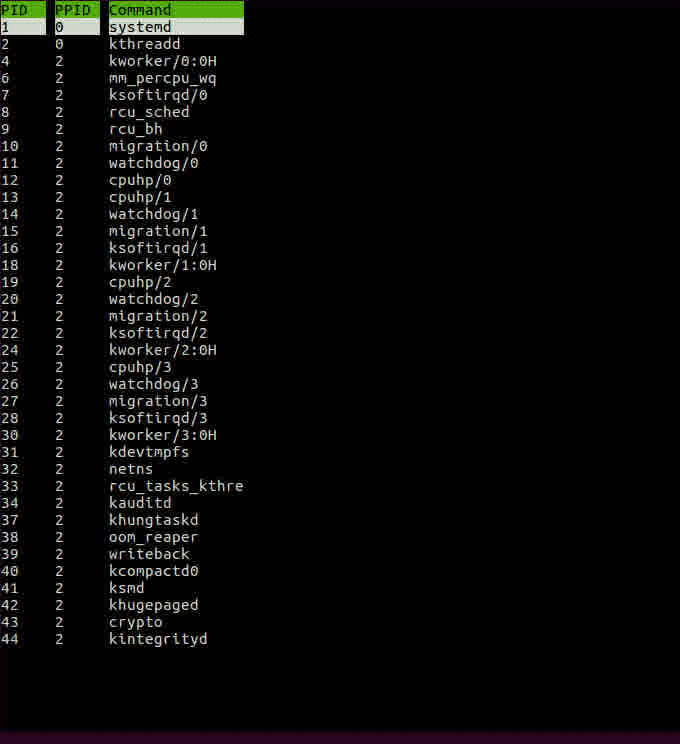
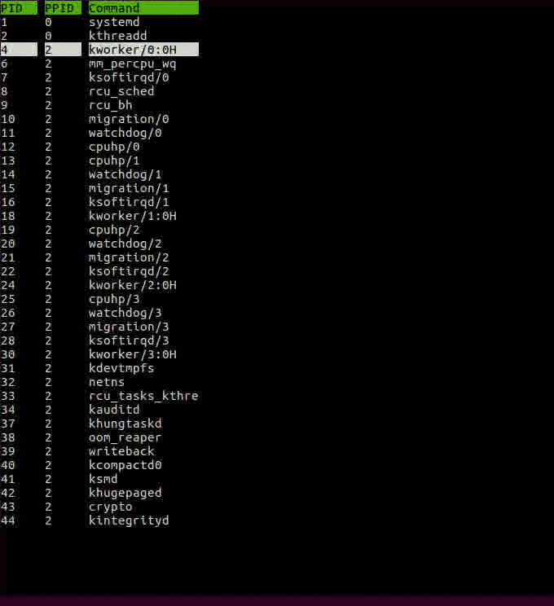
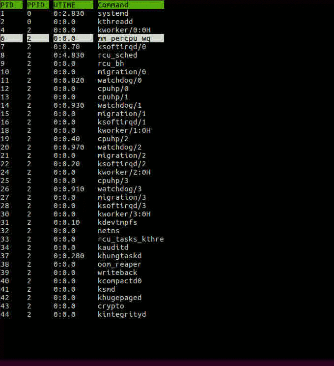

# rtop - a system process monitor 

What is **rtop**? It is not an acronym, it is named so because it is very similar to [htop](https://github.com/hishamhm/htop), a widely used system process monitor, named after its original creater - Hisham Muhammad. I decided to create rtop to exercise my c++ skills. In my effort, I have taken ideas from htop's user interface. Infact, **rtop**'s interface looks exactly like **htop**'s - no point trying to come up with usability aspects when the wide htop user base testifies to its excellent usability. I myself have enjoyed using it. Since my goal has been to exercise my c++ skills, I have built **rtop** from ground up guided by these [requirements](docs/Requirements.md), its completely of my own design, which I have described is this [design document](docs/Design.md)

Currently, **rtop** can be installed on any machine running Ubuntu 16.04 LTS (Xenial). The installation instructions and a brief demo of rtop's capabilities are provided below

## Installation

rtop has 3 major dependencies - Boost.Log library, pugixml library (an XML parser) and Ncurses library. One needs to install them (in no particular order) before compiling and running rtop. I will detail the dependencies installation followed by instructions on rtop compilation 

### Clone rtop

Clone rtop into you desired folder
```
> git clone https://github.com/kasliwalr/rtop.git   # this will create an rtop folder
> tree -L 1 ./     # displays contents of rtop folder in tree form
./
├── config
├── docs
├── include
├── LICENSE
├── README.md
└── src
```

### Boost.Log installation
[Boost](https://www.boost.org/) is a C++ library suite (much like standard template library) with frequent new releases. I have used release [boost1.63.0](https://www.boost.org/doc/libs/1_63_0/). 

1. Download boost source code for v1.63.0 from [sourceforge](https://sourceforge.net/projects/boost/files/boost/1.63.0/). Download the *.tar.gz* file. You could download it anywhere, I downloaded it to *Downloads* folder and extracted it into *boost1\_63\_0* folder
```
> cd ~/Downloads
> wget https://sourceforge.net/projects/boost/files/boost/1.63.0/boost_1_63_0.tar.gz
> tar -xvf boost_1_63_0.tar.gz             # creates boost_1_63_0 folder and extracts contents into it 
> cd boost_1_63_0
```
2. Install Boost.Log binary. Detailed information can be found at the Boost's [Getting started on Unix variants guide](https://www.boost.org/doc/libs/1_63_0/more/getting_started/unix-variants.html#easy-build-and-install). 

The *boost_1_63_0* folder contents look like so
```
> tree -L 1 ./
./
├── boost
├── boost-build.jam
├── boostcpp.jam
├── boost.css
├── boost.png
├── bootstrap.bat
├── bootstrap.sh
├── doc
├── index.htm
├── index.html
├── INSTALL
├── Jamroot
├── libs
├── LICENSE_1_0.txt
├── more
├── README.md
├── rst.css
├── status
└── tools
```
We need to run the `bootstrap.sh` script. Since, we don't want to install all packages (takes a long time), we invoke the following command
```
> ./bootstrap.sh --with-libraries=log  # root privilige is required to install in /usr/local. only installs Boost.Log
> sudo ./b2 install
```
This may take **5-10 minutes**. So be prepared to wait a while. You can verify installation by checking `/usr/local/lib`, in there you should find `libboost_log.so` and some other boost libraries as well which are dependencies of `Boost.Log`. 
 
### NCurses installation
 
 NCurses is a library used for building text user interfaces on Unix systems. It talks to the terminal emulators (your typical linux terminals) on behalf of the application - using its API, it becomes easy to program for capturing keyboard input and sending output to the terminal. Ncurses is distributed as debian package, so we use apt-get facility 
 
```
> sudo apt-get install libncurses5-dev libncursesw5-dev
```
 
### pugixml installation

[pugixml](https://pugixml.org/) is an XML file parsing library. We use xml files to configure our user interface and system interface, hence the need to use it. 

1. Download pugixml for linux from [pugixml's git repo](http://github.com/zeux/pugixml/releases/download/v1.9/pugixml-1.9.tar.gz) into *libs* subfolder of *rtop* folder and extract contents into *pugixml-1.9* subfolder of *libs*
```
> cd rtop  # navigate to rtop folder 
> mkdir libs
> cd  libs
> wget http://github.com/zeux/pugixml/releases/download/v1.9/pugixml-1.9.tar.gz
> tar -xvf pugixml-1.9.tar.gz  # will automatically create pugixml-1.9 folder 
```
2. Modify pugixml source code. This step is required
```
> cd pugixml-1.9/src
> ls
pugiconfig.hpp  pugixml.cpp  pugixml.hpp
```

Open *pugiconfig.hpp* in your favourite editor, and uncomment line 44. The code should look like so
```
43  // Uncomment this to switch to header-only version
44  #define PUGIXML_HEADER_ONLY
```

### rtop compilation

Create a folder in *rtop* to hold the executable, call it *bin*
```
> cd rtop
> mkdir bin
> tree -L 1 ./     
.
├── bin
├── config
├── docs
├── include
├── libs
├── LICENSE
├── README.md
└── src
```

Now navigate to *src* subfolder of *rtop* folder and invoke the Makefile to build the binary 
```
> cd src
> ls
Makefile  rtop_v0_1.cpp
> make -B             # invoke make, it will read the accompanying Makefile, compile code and store executable in bin
```
Note that I am using c++11 flag with gcc version later than 5.4.0. The compiler will generate some warnings, this is ok, it does not create any issues. This warning will be eliminated in future revisions.

### rtop demo

The application is started by opening a terminal window. Navigate to *rtop* folder on your computer, and locate the binary in *bin* subfolder. Invoke the executable as follows
```
> pwd
location_of_rtop/rtop/bin
> ./rtop_v0_1 ../config/CONFIGv0_1.xml    # the config file is a required parameter
```

This should start the application, which should show the following view

</br>

The image is showing 3 columns for process id, parent process id and cmdline string for invoking the process. This is the default, as we see below we can change it. 

You can scroll up and down the list using the <kbd>&uarr;</kbd> or <kbd>&darr;</kbd> keys. 

</br>

You can add more properties to view. To accomplish this, navigate to process settings view by pressing <kbd>F2</kbd>. In this view you see two columns for active properties and all properties. You could navigate between the two using <kbd>&larr;</kbd> and <kbd>&rarr;</kbd> keys. Whatever is in the active properties column will be visible in the process view. 

</br>

In this demo, we add UTIME (user time) property to all properties. We navigate to all properties, scroll down using <kbd>&darr;</kbd> to UTIME, press <kbd>ENTER</kbd> to select it, its color will change to orange/yellow from blue. Now pressing the <kbd>&larr;</kbd> will move it to below the currently selected property in active properties. So UTIME goes below...Note that order of properties in active properties (top -> down) corresponding to column order in process view (left -> right)


Now to view the results of your actions, press <kbd>ESC</kbd> to return back to process view

</br>

To add another property, go back to process setting view by pressing <kbd>F2</kbd>. You could also delete properties from active properties column, or rearrange the order of items. 

</br>

In this demo, the PPID (parent process id) was selected, and <kbd>Del</kbd> was pressed to remove it. Then STIME (system time property) is added to active properties column, since we want STIME to come after UTIME, we press <kbd>ENTER</kbd> (indicated by organe color) to select it for editing, and then press <kbd>&darr;</kbd> to move it below UTIME. Pressing <kbd>ENTER</kbd> again, releases the edit mode. Navigate back to process view mode (press <kbd>ESC</kbd>) to view the results. Here, we have properties displayed in desired order.  


## Licensing
[](https://opensource.org/licenses/MIT)
## Authors
Rishabh Kasliwal
