# rtop Design v0.1
## Table of Contents
- [Introduction](#introduction)
- [Architecture](#architecture)
  - [Building blocks](#building-blocks)
    - [System interfacing](#system-interfacing)
    - [Business logic](#business-logic)
    - [User interface](#user-interface)
    - [Error handling](#error-handling)
  - [How do subsystems interact?](#how-do-subsystems-interact)
    - [Viewing of process information](#viewing-of-process-information)
    - [Configuring process viewing](#configuring-process-viewing)
  - [Extensibility](#extensibility)
  - [Tooling](#tooling)
    - [Language choice](#language-choice)
    - [Linux API](#linux-api)
    - [C++ style guidelines](#c-ctyle-guidelines)
    - [Version control](#version-control)
    - [Debugging](#debugging)
    - [Testing](#testing)
    - [Distribution](#distribution)
    - [Logging](#logging)
    - [Development tools](#development-tools)
    - [Third party libraries](#third-party-libraries)
- [Design](#design)
  - [Overview](#overview)
  - [Architectural considerations](#architectural-considerations)
    - [Separate thread for key input](#separate-thread-for-key-input)
    - [Key contexts](#key-contexts)
    - [Single key, single context but many actions](#single-key-single-context-but-many-actions)
    - [UI layout performance](#ui-layout-performance)
    - [Screen resizing](#screen-resizing)
    - [State machines](#state-machines)
    - [Accessing and parsing /proc database](#accessing-and-parsing-proc-database)
  - [Before we begin](#before-we-begin)
    - [UI classes](#ui-classes)
    - [Key dictionary](#key-dictionary)
    - [Callbacks](#callbacks)
    - [Logging](#logging-using-boost)
    - [Configuration management](#configuration-management)
    - [Keyboard and mouse input](#keyboard-and-mouse-input)
  - [Analysis through use cases](#analysis-through-use-cases)
    - [Periodic refresh](#periodic-refresh)
    - [Key input](#key-input)
    - [Changing settings](#changing-settings)
    - [Sorting by selecting property using mouse](#sorting-by-selecting-property-using-mouse)

- [References](#references)


## Introduction

This is a design document, it details the design of **rtop** version 0.1 guided by these [requirements](Requirements.md). This is meant for use by any developer who wants to understand/modify the rtop code. There are some prerequisites for this document to be well understood. It is assumed that

- developer is familiar with system process monitors in general, whether on Windows (Task Manager) or Linux (htop, top, etc). 
- developer knows what a [Linux API](https://www.amazon.com/Advanced-Programming-UNIX-Environment-3rd/dp/0321637739/ref=pd_sbs_14_t_0/146-1285804-3553013?_encoding=UTF8&pd_rd_i=0321637739&pd_rd_r=77634f80-b533-4cc6-846a-6d1224f1e90a&pd_rd_w=9hn11&pd_rd_wg=jlWXS&pf_rd_p=5cfcfe89-300f-47d2-b1ad-a4e27203a02a&pf_rd_r=B867YQYV8ZSW30CT361V&psc=1&refRID=B867YQYV8ZSW30CT361V) is, knows what we mean by [POSIX](https://en.wikipedia.org/wiki/POSIX) or [SuSv3](https://en.wikipedia.org/wiki/Single_UNIX_Specification) compliant
- developer is familiar with C/C++ and data structures including lists, hash tables and trees 

This document talks about two things - the architecture and design of rtop. In the architecture section, a broad overview of the main subsystems of rtop is provided with references to important requirements about the visual structure and functionality of rtop. Also provided is a list (in some cases with rationale) of the tooling used in this project, so that the developer can jump start his/her changes with minimal tooling research or replace some tools based on his/her preferences. The design section details the subsystem design. ~We detail how each subsystem achieves its goals by describing in detail the rationale behind its decomposition into classes to achieve the desired functionality. Design alternatives will be discussed where ever possible~ (??). The language will be terse and diagrams will be used as a substitute for words. 

If you want to try [rtop]()'s features to get a feel for things, see this [README](../README.md) for installation instructions

## Architecture

What is a text user interface? Let's break it down. It is a user interface - the user can interact with it (i.e. manipulate it and also receive visual feedback). The visual feedback is all text-based - all you can see on your screen is text. It may be tabulated/highlighted but that is pretty much the extent of it. When interacting with it, the user will typically be navigating across the screen and selecting some options. However, unlike the graphical user interface, navigation is restricted, in the sense that one can only move in quanta of horizontal characters and vertical lines on the screen. Text user interfaces (TUI) are commonly used on today's [terminal emulators](https://en.wikipedia.org/wiki/Terminal_emulator) which emulate [character-based visual displays](http://toastytech.com/guis/remoteterm.html) which did not have the capability of pixel-level resolution. The limited spatial navigation capability may sound limited, but you may find that many text-based user interfaces are quite rich - using just text highlighting and structured layout, a text user interface can have tables, hidden menus and so forth.

So what does it take to build such a text user interface? The following sections discuss the major points in building the text interface for rtop which is deployable on Linux, specifically Ubuntu 16.04 LTS Desktop version 
### Building Blocks

TODO??: should we relate our design to MVVM or MVC (don't even know what they are?)

Every text interface can be thought of as consisting of multiple building blocks each of which performs a specific function. There are three major concerns we are trying to address when building a text user interface. 

1. How to build a text interface on the Linux systems? How to display information on a Linux system? How to acquire input from the user's keyboard and mouse actions? 

2. Second is about the specifics of the application or what is commonly referred to as the **business logic**.  How to acquire and store information about processes? How to present this information? 

3. How to design the system in a maintainable, extensible and clean manner?

We address our concerns by first assigning them to different subsystems, which are described below

#### System interfacing 

There are many ways one can obtain information about a process's properties. The Linux kernel maintains this information in kernel data structures. Linux offers an API \(see [procfs](#accessing-and-parsing-proc-database) in design section\) that allows users to access this information by reading process specific files. This information must be acquired at regular intervals or asynchronously (on user input), stored at one place, from where it can be efficiently accessed or manipulated (for example sorted).
 
System interfacing module's job is to provide a simple API (to be used by other modules) that abstracts away the details of how the process specific information is acquired. 

One good reason for hiding the OS specific details of how process information is accessed is **portability** - different revisions or distributions of the Linux kernel store processes information differently and make is accessible using different APIs (??citation). The other reason is that it makes the development work more modular and therefore efficient. 

#### Business logic

This module concerns itself with how the information is laid out (how many views? what is in each view?). This part follows from the [user interface requirements](Requirements.md#user-interface). It also concerns itself with error handling. How to manage [wrong input](Requirements.md#handling-bad-input) and conditions that can potentially cause the system to crash? How to recover from such inputs and crashes? Finally, it concerns itself with usability.  What are all the features accessible to the user?

So the business logic module draws heavily on the functional requirements - what the user can/cannot do. What is bad input? , how is bad input handled?  This module also orchestrates the actions of the other modules to achieve the desired functionality. 
 
The reason for existence of this module is to separate the rules/logic from the object on which they act. This module is similar to the *model* in the [MVC](https://en.wikipedia.org/wiki/Model%E2%80%93view%E2%80%93controller) design pattern. 

#### User interface
This module is concerned with managing the mechanisms underlying the display of text user interfaces on Linux systems, and how to acquire input through mouse and keyboard. It is also responsible for ensuring that input acquisition and output generation are sufficiently fast. For example, there should not be too much of a delay from a key press to it being detected by the system, nor a delay between instruction to display information and it being displayed on screen.

This module's job is to abstract away the lower level details such as configuring and managing terminal emulators on Unix-like system and provide a flexible API that allows one to build a sufficiently detailed layout of the interfaces, one that can be extended easily.
One important benefit that this module allows is simplifying the task of the business logic to create layouts and capture user input. This simplifies the business logic significantly and hence reduces the overall complexity of the system. Secondly, it increases the portability of the business module, by allowing the business module to use the same API across different terminal emulators and different systems. If you want to display the text user interface on different terminal emulators, you only need to generalize this module to handle that, the business logic remains the same. You can view this module as an amalgamation of the view and controller in the [MVC](https://en.wikipedia.org/wiki/Model%E2%80%93view%E2%80%93controller) design pattern. 


#### Error handling

This subsystem is concerned with how to handle error conditions generated in the various subsystems and the overall operation of the program. It concerns itself with providing information to the developer/user to enable them to find the sources of errors and the actions that need to be taken to mitigate them. The error handling depends on the specifics of the function/class etc, but in general, this module will try to do one of three things:

1. ignore those errors
2. take some corrective measures
3. log and crash so that some debug information is accessible to the developer

This module contains logic that recognizes error conditions, defines error messages, defines log formats and interacts with logging framework. The development of this module progress with design as more error conditions are uncovered.

So this module's job is to define errors and handle them in appropriate ways - such as ignoring, exiting the application, logging, etc. Logging (read more on [logging](#logging-using-boost) in design section) is a minimum requirement.

The most important benefit that error handling provides is proper logging, which helps in uncovering bugs during development as well post shipping.

### How do subsystems interact?

To better understand the working of rtop, it is important to understand the interaction between its different subsystems. The discussion is at a very high level, and the goal is ??

#### Viewing of process information
This is a somewhat passive activity where the user can view the periodically updated process information. Occasionally, the user may interact with the view by scrolling through the process list or clicking on a specific property list to change the sorting criteria.

The data flow during the 3 use cases is described below:

1. During a periodic update, the business logic initiates a read of system information from the system interfacing module. It is estimated that ~25-100KB of information travels between the system interfacing and business logic modules (25 property fields per process, 10 characters per field and 100's of such processes). The data is then transferred from the business logic to the user interface module for display. There is also information travel from the application's system interfacing module to kernel databases (not shown in Fig 1)

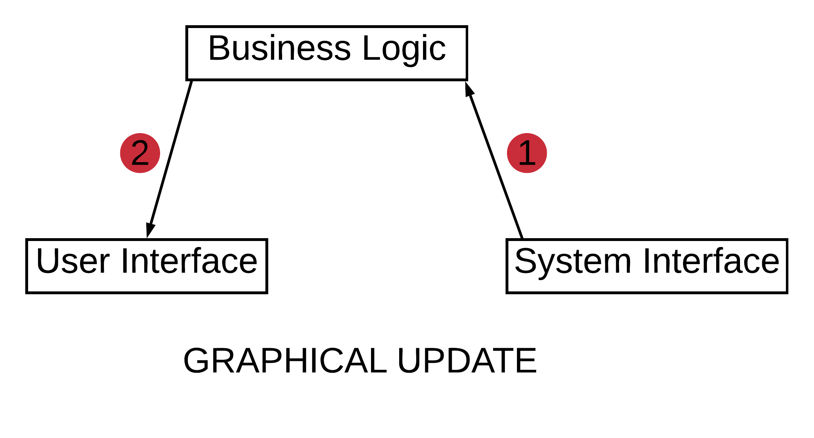

**Fig. 1** Inter-module data flow during a periodic graphical update

2. Scrolling the process property list: When the user is scrolling through the process property list, the <kbd>&uarr;</kbd>/<kbd>&darr;</kbd> key input information travels from the user interface module to the business logic module. The business logic module performs the required changes to its representation of displayed data and sends back the new position of the scroll cursor to the user interface module for display. There is no data flow into or out of the system interfacing module. 


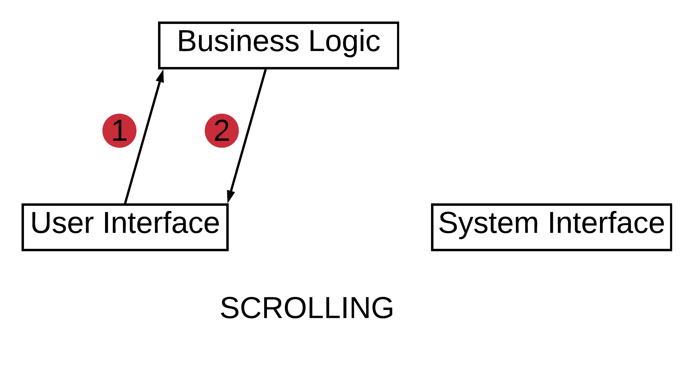

**Fig. 2** Inter-module data flow during scrolling

3. Sorting the process property list: When the user mouse clicks a particular property to change the sorting criteria, the click information travels from the user interface module to the business logic module. The business logic module instructs the system interface module to acquire new process information ([why read process information for a sort request?](#sorting-by-selecting-property-using-mouse)) resulting in data flow from the system interface module to business logic. The business logic module sorts this information and passes it onto the user interface module. 

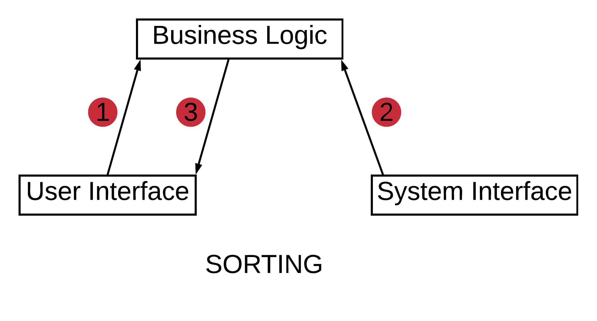

**Fig. 3** Inter-module data flow during sorting


#### Configuring viewable process information 

The user can configure the user interface so that only the relevant process properties are viewable. Further, the user can also reorder the property lists for more suitable viewing. To accomplish these objectives, the user carries out a series of key presses as described in rtop demo in [README](../README.md#rtop-demo)

During all such activities, the data flow only occurs between the user interface module and the business logic module. As soon as the business logic receives a key input, it updates its internal database and sends fresh display information back to the user interface module. The data flow would be similar to the diagram corresponding to the scrolling use case (Fig 3). 


### Extensibility  
TODO??: revise

We would like to build upon the exiting version viewing of additional information. 
1. is to allow the system to [add new process properties to view]
2. add additional views for configuring other properties. 
3. add additional views for viewing overall system resource usage information, and associated view for viewing those. 
4. add additional functionlity in process view that allows the user to filter/signal processes, or view them in some alternate format altogether


Interface layout can be specified in text files. This is standard practices in most user interface technologies - whether .NET or Xamarin forms or anything else. This makes the task of specifying additional views in termns of layout easy. Offcourse any additional view does not exist in vaccum, we must hook it up appropriately so that it connect to some business component or data source appropriately. Therefore we must develop a hooking infracstructure that should allow us to easily accomodate new views

Any new view should allow some intraview navigation , for example can be scroll in it, how do we navigate between the different panels within it and so on. There should be some framework, according to which we build a view, that is what can and cannot go into it.  


### Tooling


#### Language Choice
The source code will be implemented exclusively in C/C++. The terminal interfacing code is written using the Ncurses library API (which is in C). It is called from within C++ (how??, is this portable??). Build scripts are written in [make](https://www.gnu.org/software/make/) compliant language. Configuration files are written in XML (v1.0, UTF-8). 

The reason for choosing C++ (as mentioned above) is to get familiar with it. An important advantage is that C++ has excellent support for object-oriented design which is a must have for building complex text user interfaces.
 

#### Linux API

Since this project aims to deploy this application primarily on Linux based systems, Linux system calls and GNU C calls are used to read process information inside of the kernel database. The choice of specific API calls is dependent on whether they require special privileges, making them either inaccessible from either user space or by a non-admin user. The other consideration is that their use should not jeopardize **portability** across different Linux systems and versions (near future and past Linux distributions). To avoid such problems, an attempt will be made to follow best practices such as using POSIX compliant system calls. 

#### C++ Style Guidelines
TODO: need to add specific guidelines

[Google C++ style guidelines](https://google.github.io/styleguide/cppguide.html) will be followed. Some of the important ones have been listed below. The main purpose is to ensure good **maintainability**


- google c++ style guidelines, source tree hierarchy
  - namespace organization 
  - class naming, class declaration
  - class public, private organization
  - class method naming and font
  - class method arguments naming and font conventions
  - standalone functions, globals, static
  - commenting and doxygen documenting: comments on classes, functions, globals, standalone functions


#### Version Control

Git has been used for revision control. Since this is a single developer project, most features are added  sequentially. Features are developed on the *dev* branch, this includes code implementation, testing and documentation. Once a feature is reasonably complete which means its code is working and tested well and its documentation is in good shape, it is merged into master/release branch. This merged commit, is a new release which is identifiable using a tag. The tags are named according to a numbering scheme of the form x.y, where x is version number followed by y which is features number. This process is clarified through the diagram below

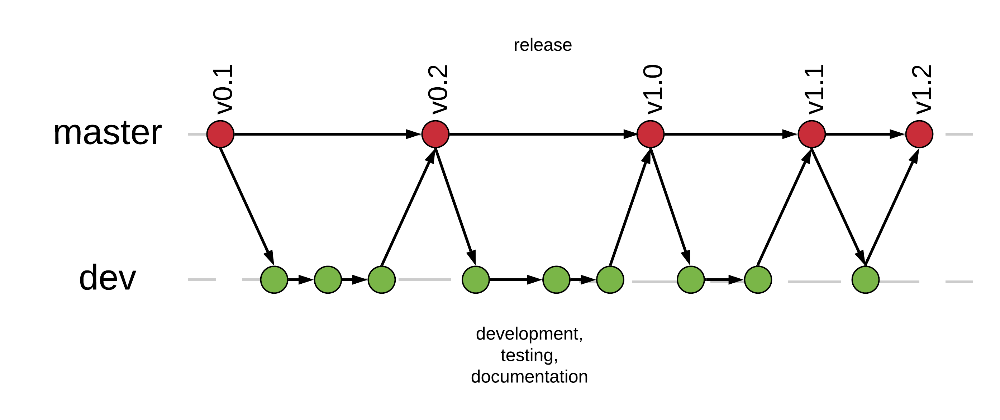</br>
**Fig. 4** Git workflow for rtop

A not so uncommon scenario is that a developer may get stuck on some particularly tricky feature while progress can be made on some non-interfering feature. In such a case, a temporary branch is created off the *dev* branch (not shown in the diagram). Once work is complete on the *temp* branch, it is merged back into the *dev* branch (NOT *master*)

A user or developer can access the release commits using tags that specify version numbers. Each release has its README, REQUIREMENTS and DESIGN documents. REQUIREMENTS and DESIGN documents corresponding to the same version of software to which README belongs are accessible from hyperlinks within the README

#### Debugging 

Debugging is performed using GNU debugger [>= gdb v7.11](https://www.gnu.org/software/gdb/). Memory leaks are checked using [valgrind](http://valgrind.org/) tools suite. Logging is performed using the Boost logging library. Further details on logging system are provided [here](#logging) 

?? How have we done the debugging
?? lcurses_g option

#### Testing

TBD

#### Distribution

Releases are available on the master branch [rtop project repo](https://github.com/kasliwalr/rtop). Each release contains the source code, installation/use instructions, requirements, and design document, provided under MIT License. The source code organization is described below

```
# source tree
.
├── bin
├── config
├── docs
├── include
├── libs
├── README.md
├── src
└── tests
```

|Source Tree Object| Description|
|-----------------|-------------|
|src| folder containing source code i.e. the *.cpp* files|
|include|folder containing header files|
|src/Makefile|make recipe file|
|bin|top level directory of build tree|
|config|folder containing configuration files|
|tests|folder containing testing code|


In the future, an appropriate package distribution method will be used for each targeted Linux distribution 

TODO??: 
- add license notices to source code
- also need to check if license is compatible with license of tooling used. 
 
#### Logging

The major criteria for selecting a logging system are as follows

1. should support formatted output
2. should print thread specific information
3. should have a C++ API
4. should be open source, ideally [copy-left](https://www.gnu.org/licenses/copyleft.en.html) like GPL, but non-copy FOSS is also fine (a requirement for using 3rd party code)
5. should be reliable and well supported (as indicated by a large user base)
6. should have a stable API (fewer problems for maintaining code base)
7. compatible with Linux and other Unix-like systems 

For this project, [Boost.Log](#third-party-libraries) package has been chosen for logging. 


#### Development Tools

The development was done on an Ubuntu 16.04 LTS, with the following tools
1. gnu compiler collection: [>= gcc 5.4.0](https://gcc.gnu.org/)
2. vim editor: [>= vim 7.4](https://www.vim.org/). 7.4 or greater. This is a personal preference. Any editor suitable to the developer could be used
 
#### Performance Measurement

TBD

#### Third Party Libraries

1. Ncurses: TBD

2. Boost.Log: TBD

3. Pugixml:TBD

## Design

This section dives into the design of rtop. It will serve as a guide for current or future developers, by helping them understand the source code, add new features and improve application performance. The discussion begins with a bird's eye view of the system and then dives deeper into implementation details (with rationale) of specific modules, classes, and functions. The system function is illustrated through studying the interactions amongst rtop's components while exercising important use cases.

### Overview

From a systems perspective, at the top-most level, rtop interacts with 3 external entities (see diagram below) They are a 1) a persistent database, 2) process file system (*procfs*), and 3) the user. The rtop application loads information from the database during initialization and stores information into it before shutdown.  *procfs* provides process information. The user consumes data by viewing the results displayed by rtop. The user also provides commands to rtop through its text based user interface. 

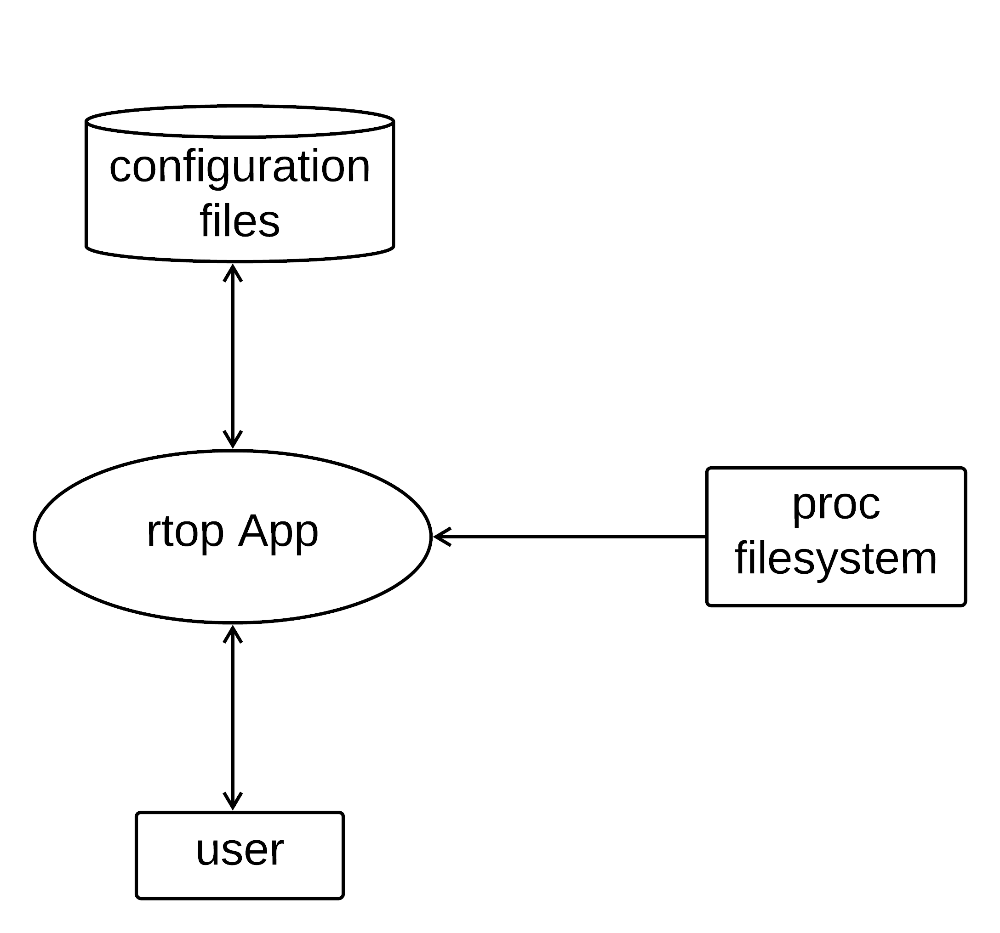</br>
**Fig. 5** Data flow between the external environment and the rtop application. User and rtop exchange data through the keyboard and screen. rtop interacts with persistent database on the file system to access configuration information. It reads process information residing in kernel databases using the Unix's */proc* file system API


At a lower level abstraction, the rtop application is decomposed into submodules (as mentioned in the [architecture section](#building-blocks)). These modules are depicted in the diagram below

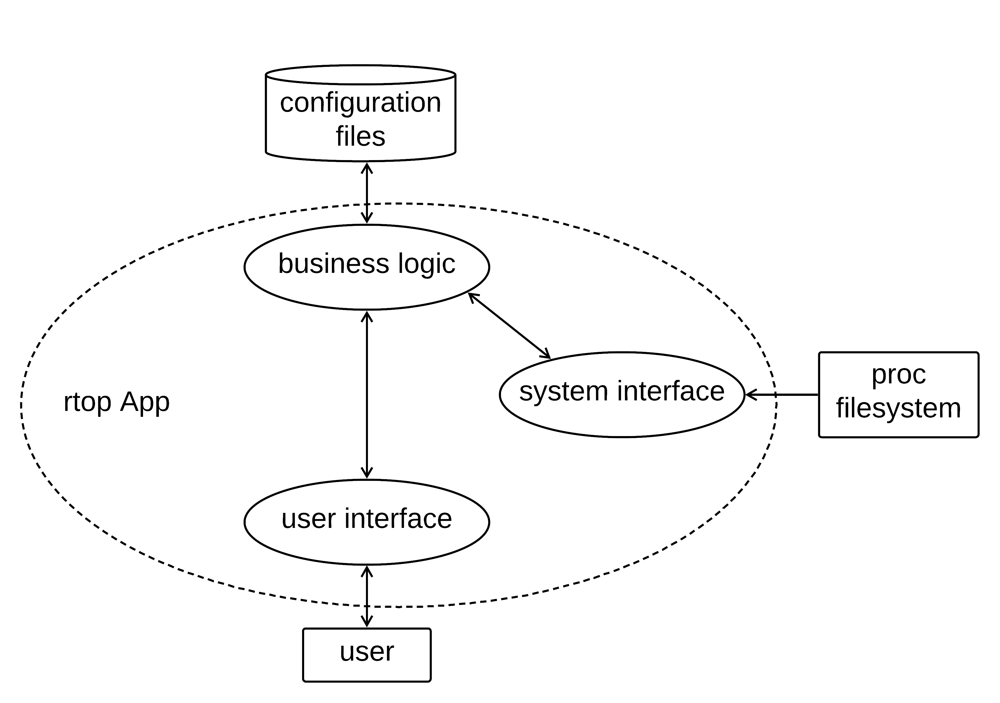</br>
**Fig. 6** Data flow between the different submodules of rtop, and between the submodules and external entities. Business logic reads configuration information and initializes all other modules. It frequently interacts with both the system interface to read process information and the user interface to display that information. The user interface interacts with the user and the system interface reads information from the process file system, *procfs*


Before diving deeper into architecture and design, it will be helpful to have some perspective on the meta design goals - those that fall into good design practices. 

Maintainability - Software modules should have a clearly defined purpose. The classes within these modules should do one thing and one thing only - single responsibility principle (SRP). The interfaces should be thin (few arguments). Code should be well commended. 
 
Extensibility - rtop will be extended in many ways. One way would be to make it work across different Unix derivatives, another important way it may change is by addition of new features or modification of existing ones. These include allowing the user to change key bindings, to use rtop exclusively through mouse/touchpad or a keyboard. Thirdly rtop may undergo internal changes to its data structures/algorithms for tweaking performance. The system should be easy to extend if one is trying to achieve any of the above objectives.

Clean design - rtop will lean towards simpler design - simple data structures and algorithms when there is no significant benefit of using a more elaborate one. 

Performance - at this point in time, specific performance criteria have not been defined. In general, rtop's performance is deemed adequate it it's able to display information at regular intervals and uses memory within limits (say a few megabytes)
  

### Architectural considerations

The following are design decisions that sit at the boundary between architecture and design. They govern important ways in which we approach the various design problems we face

#### Separate thread for key input

The application has two major activity loops that run on independent threads. One loop is responsible for periodic graphical updates while the other handles the user's key inputs. Handling user's key input in a separate thread allows optimization of user experience by ensuring that none of the user's key inputs are missed because the system is busy performing graphical updates. If the CPU is switching between the two threads sufficiently fast, the key input loop will be able to capture all of the user's key inputs.

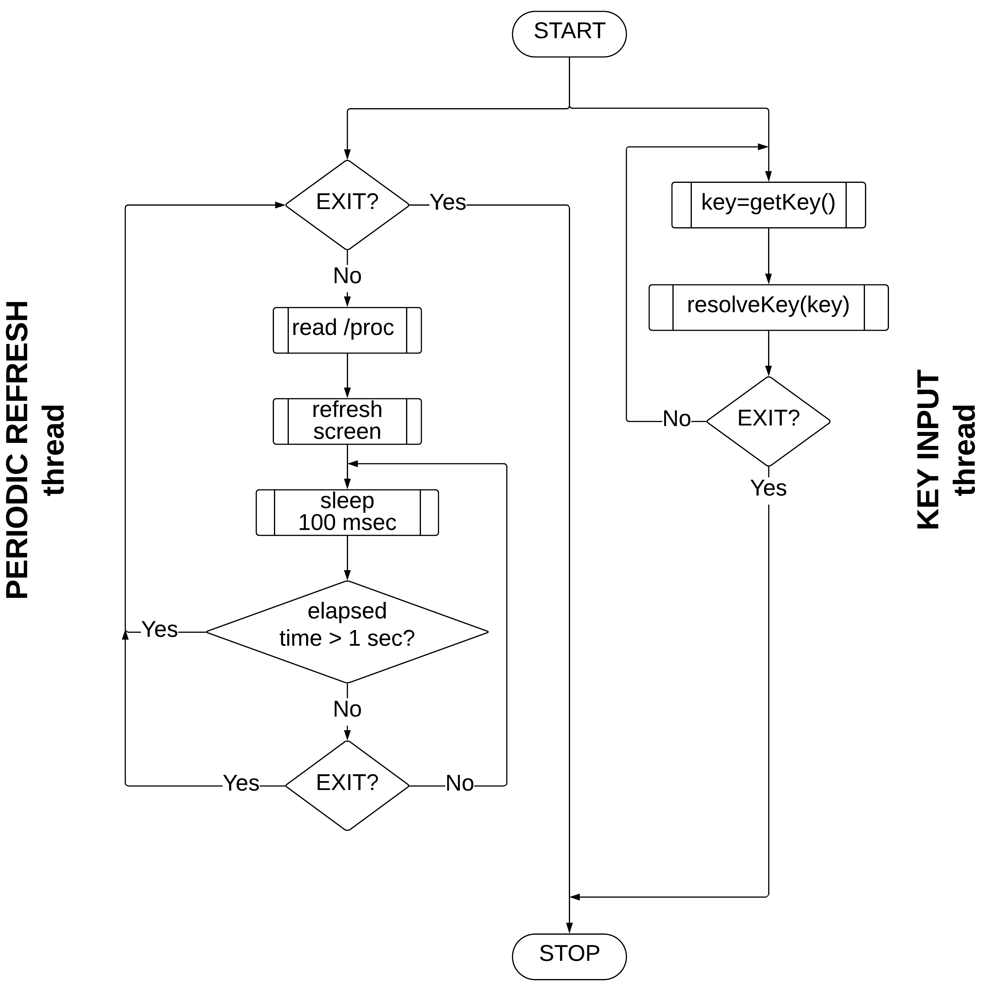</br>
**Fig. 7** Activity loops of rtop. Each loop runs on a separate thread. 


It is important to be aware of the limitation of this scheme. Although key inputs are being captured on a separate thread, a similar problem as running everything on one thread is encountered. If the key press results in a time consuming graphical update, the key input thread will be blocked (inside of the `resolveKey(int key)` function). Any key input that arrives during this time will be lost. If the user is pressing the keys frequently, the interface will appear unresponsive. So the question then is - how much time does the thread have before it should be available again looking for key input? 

For answering the above question, one must estimate the fastest frequency at which the key inputs can arrive. Reports ([1](https://blog.wooting.nl/what-influences-keyboard-speed/), [2](https://danluu.com/keyboard-latency/)) suggest that for typical keyboards, key input speed ranges between 30-60 key presses per second, which translates to 1 key press every 15-30 msec. The key input speed was measured on the development system, and found to be approximately 30 key presses per second. 

Here is the reference code for doing that
```
 // using ncurses api
 
 int main(){
 // ncurses initialization
 initscr();
 raw();
 noecho();
 keypad(stdscr, TRUE);
 set_escdelay(100);

 int c;
 int count_arrow = 0;    // holds number of key presses
 while(1)
 {
   c = getch();         // capture key input
   if (c == KEY_F(10))  // exit on F10
    break; 
   count_arrow++; 
 }	
  
 endwin();
 std::cout<<"KEY_DOWN pressed "<<count_arrow<<" times\n";  
}
```
>Note: While the program was running, a key was pressed (not <kbd>F10</kbd> since that exits from the program) and kept pressed continuously for 10 seconds. Then, <kbd>F10</kbd> was pressed to exit the program. On exit, the program prints the number of key presses registered in the 10 second duration. Note that the measurement loop wastes little time doing anything else, and most time is spent waiting for a key input. The measurements are not underreported due to the slowness of the measurement loop - it is quite obvious that the measurement loop is much faster. The computation performed in the loop - one comparison, and one increment - doesn't take more than a few cycles, and on a GHz CPU, a few nanoseconds at most. Even if thread switching is taken into account, it should not take more than a few milliseconds. So, the above measurement loop should correctly report key input speeds upto 100HZ or more. Another assurance comes from the fact that the numbers align well with the above mentioned reports


#### Key's context

To understand rtop's design, it is necessary to understand the somewhat abstract idea of key's context. The application should be viewed as consisting of different contexts. Actions such as exiting the application or viewing a separate view (a view covers the entire terminal window) belong to the application context. Actions such as navigating within a view by accessing its different panels ( a view is divided into several spatially separate regions called panels) belong to the view context. Finally, actions such as browsing/modifying an item list within a panel belongs to the panel context.

Therefore, each key has a context in which it makes sense, and the context alone knows how to interpret the key. Also, note that the same key may have meaning in multiple contexts, therefore a single key can lead to actions in several contexts. 
 
#### Single key, single context but many actions

So how does rtop actually interpret the key? The information required to interpret the key resides in a UI object. A UI object may be required to resolve more than 1 key, it certainly may be required to perform several actions on receiving a single key input.

One potential strategy is to devise a specialized UI object that handles a particular set of keys and carries out a particular set of actions. Adding a new key-actions pair requires the creation of a new type (of UI object). This would lead to a proliferation of the types of UI objects based on the number of key-action combinations (which can run into 100s). This is clearly not scalable for maintainability.

Another strategy is to allow the UI object to hold this information in another object, one similar to a dictionary. This dictionary object represents key context, and it can be identified using a *universal unique identifier* (UUID, see its use later [callbacks](#callbacks) discussion). Importantly, it contains an actual dictionary (a hash table), containing a list of key-value pairs, where each key represents a key input, and a value is a list of actions. Note that there can be more than one action associated with a single key value. You'll find the implementation details in the discussion on the [key dictionary](#key-dictionary). Let's consider an example to clarify the idea. Assume, that a key input arrives at UI object. On this input, 5 different actions need to be performed. The key dictionary associated with this UI object is asked to resolve the key (its a little more complicated, see [state machines](#state-machines), which it will do by looking it up in its lookup table. If the key is found, all the actions associated with it will be invoked in a sequential manner.

This strategy offers a major improvement over the first one. One can easily define a new key dictionary object that encodes a certain behavior. These objects can then be used to initialize the UI object at the time of application startup. There is no need to create new types of UI objects, only a single type, that can hold different key dictionary objects, and able to resolve different sets of keys. For example `View1` object of type View resolves <kbd>F1</kbd> a certain way, and `View2` object of the same View type, resolves <kbd>F1</kbd> another way because they hold different key dictionary objects.

#### State machines

The key dictionary mechanism described above has to be a little more general, this is needed to address the following problem - association between a set of keys and actions is not fixed. This is a very common situation, for example when one presses a specific button on a digital watch, watch screen contents change, and now the same button has a different meaning, infact many different keys have their meaning changed. 

This problem is handled using a state machine, instead of a `KeyDict` associated with a UI object, we have a [state machine of `KeyDict` objects](#key-dictionary) associated with each UI object. The states in the state machine are the `KeyDict` object UUIDs. 

State machines are also used for other purposes in the application. There are state machines for [UI objects](#ui-classes), specifically state machines for `View` and `Panel` types. These state machines help the UI object determine as to which of its child object has [focus]()

A state machine's API does 3 basic things. It allows initialization of the state machines' transition table, performs the transitions based on some input - specifically key input and allows accessing state information by other modules in the application. 


#### Section on Focus

TBD

#### UI layout performance


Although performance optimization is not a priority at this time, there is one area where upfront optimization is well advised. To understand its need, it is important to understand how NCurses performs graphical updates.


Ncurses introduces some abstractions between the data to be put on screen and actual physical screen. The crux of the matter is to use these abstraction properly so as not to unnecessarily slow down the graphical updates. 

NCurses internally maintains a representation of the **physical screen** (the state of the physical screen when last updated), and a **virtual screen** (which is the screen's state that the user wants to render). Ncurses also has an abstraction called **WINDOW**, which is an object that represents a section of the screen, to be more accurate, a **WINDOW** represents a section of the **virtual screen**. A screen is usually subdivided into multiple windows - we call this a **tiled** screen because the windows are non-overlapping. rtop's screens are tiled screens. So let's say you have a tiled screen, you modify a small region of the screen corresponding to one or more **WINDOW**s and now you want to put the information onto the physical screen (top row Fig. 8 ) 


The function to perform this update has the following prototype 
```
wrefresh(WINDOW* win);
```
On each `wrefresh` two internal functions, `woutrefresh(WINDOW* win)` and `doupdate()` are called, the first one puts the information in the WINDOW data structure onto the virtual screen. The `doupdate` then compares the physical and virtual screen and pushes the difference onto the physical screen. So instead of everything being redrawn, only the region specific to the changed window is updated. This brings us to the first optimization

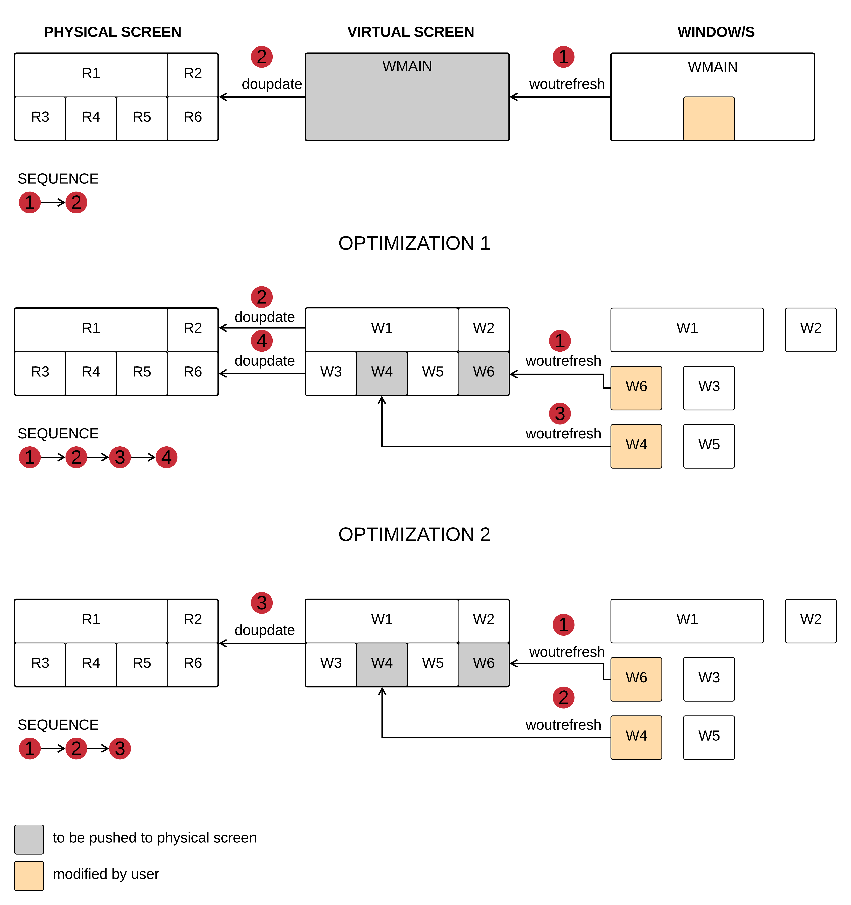</br>
**Fig. 8** Data flow during graphical updates using NCurses API

Optimization 1: Divide the screen, into separate windows, such that separate activities map to different windows. This allows us to update only specific windows and reduce the cost of physical screen update. This sequence is represented in middle row of Fig. 8


It was mentioned above that each `wrefresh` corresponds to two actions. If two window updates are happening relatively quickly (so that the user may not notice), one should avoid calling `wrefresh` for each window. This brings us to the second optimization


Optimization 2: Where ever possible instead of multiple `wrefresh`, do multiple `woutrefresh` and a single `doupdate`. 

#### Screen resizing

rtop runs on terminal emulators rather than real terminals, and thus unlike real terminals, the user can resize the screen. This user action is not handled by the terminal emulator, meaning that although the screen size is changed (by the windows manager), a signal (SIGWINCH) to the client process is sent. It is the job of the client process (in this case, rtop) to handle this appropriately. If we don't notify rtop, it will continue to assume the old window size and will try to render information on regions that do not exist anymore.

This behavior has been verified by running rtop in a debugger (such as [gdb](#debugging)). When the debugger was configured to handle the signals and run, the following output was generated

```
> handle SIGWINCH print
> r CONFIG_FILE           # run rtop_v0_1
# window resized
Thread 1 "rtop_v0_1" received signal SIGWINCH, Window size changed.
terminate called without an active exception
```

The solution to above problem is to handle the signal. The signal handler scales and repositions the layout based on the screen size information. It is important to keep in mind usability by preventing extreme resizing of the screen - very small screen size is not useful for reading information. 

#### Accessing and parsing /proc database

Process information is accessed using the [proc file system](https://en.wikipedia.org/wiki/Procfs), available on all Unix based systems. On Linux, the process information is distributed amongst multiple text files inside subdirectories of `/proc` directory. There is a unique subdirectory per process that is named with the process id (PID) value. For example to access information associated with the *init* process which has PID of 1, files in directory `/proc/1/` should be accessed.

rtop draws process information from 3 files - `/proc/pid/stat`, `/proc/pid/cmdline` and `/proc/pid/status`. The discussion below focuses on the race conditions that might be present when accessing the proc file system. For details on how to read a particular text file, refer to its format information. 

The algorithm for accessing and parsing process files is pretty straightforward. The contents of the `/proc` directory are read using the `opendir` and `readdir` system calls. The `opendir` call provides a pointer object that allows scanning through the directories' contents. This pointer is passed to `readdir` which performs the scan through the `/proc` directory, visiting each process specific subdirectory in turn, accessing files inside of it and parsing them. However, since processes are getting added and removed asynchronously, one has to careful in using these system calls and understand the guarantees they offer.  *The Linux Programming Interface by Kerrisk, 2nd* says

>If the contents of a directory change while a program is scanning it with readdir(), the program might not see the changes. SUSv3 explicitly notes that it is unspecified whether readdir() will return a filename that has been added to or removed from the directory since the last call to opendir() or rewinddir(). All filenames that have been neither added nor removed since the last such call are guaranteed to be returned.

This forces us to add logic to handle situations where subdirectories are getting added or removed from `/proc` directory. One must also understand that files inside the proc file system are not actual files, they are just an abstraction, what is actually happening when a file's information is accessed is that it is read immediately from the kernel database. It is also implied that the directory `/proc` is populated when it is opened for reading - sort of like a snapshot. When the `/proc` directory is scanned using `readdir`, we inspect each process's pid directory. It is at this time that the `/proc/pid` information is updated again. If we try to access the `/proc/pid`, but the process by that pid does not exist, the open call will return an error. New process may be also added while scanning `/proc` using readdir, in such a case, one may not scan through it and miss it. 

A summary of all the different scenarios, their implications and the decision that algorithm makes to handle them are described below:

**Table 1**

|Scenario| Analysis|Decision|
|-------|----------|--------|
|after reading process files in /proc/pid/, but before completing scan, process is killed|the algorithm will print the information, however it will be a bit outdated, but most likely the user won't notice. most certainly it will be removed at the next scan|no change, works as is|
|after opening `/proc` and beginning scan, a new process is added. `readdir` does not guarantee that it will show up in the scan|if the algorithm misses it, it will be read at the next scan. if it's picked in this scan, that's a good outcome too|no change. works as is|
|process subdirectory was present when we opened `/proc` but died before scan reached it| if the algorithm tries to open file in `/proc/pid`, it will return an error. on error, algorithm interprets the process to have died, and ignores it|no change. algorithm correctly ignores the dead process. works as is|
|process `/proc/pid` was read. before scan finished, it was killed, another process added by same pid, and then `/proc/pid` was read again before scan completes|this is highly unlikely because linux does not assign a recently deceased process's pid to another process for some time, while the read finishes much quicker on 10s of msec. If it does happen, probably the dead process's information is overwritten with alive (new) process information|no change. works as is|
|a process dies during reading of `/proc/pid` files| if algorithm is reading the last file, it would not report any error and report the process as alive - same as 1st case. if algorithm is reading the 1st or 2nd file, it will complete the read, then when it goes onto next file (2nd or 3rd), it will report an error|only in the case that last file is being read do we report an alive process. it will be updated at next scan. no change works as is|

Below is the algorithm pseudocode

```
read procfs:
 get pointer to /proc 
 for each /proc/pid in /proc:
   read /proc/pid/status, /proc/pid/stat, /proc/pid/cmdline 
   if no error in opening any of the  files:
     store information in database
```
Any process that died after its files in `/proc/pid` were read is considered alive, and its information is displayed. 

### Before we begin

Before moving onto the description of the application functioning, it is useful to get familiar with some important classes that make up the application. It helps to know about them as when data flow in different use cases is explained, things start to fall in place easily. You can skip ahead to [use case analysis](#analysis-through-use-cases) and come back refer back to this section. 

#### UI Classes

Three types of user interface classes, cooperate together to handle key inputs from the user and graphical update requests from business logic modules. These classes are organized in a hierarchical fashion. [ScreenManager](html/classrtop_1_1ScreenManager.html), sits at the top of the hierarchy, it references one or more objects of the [View](html/classrtop_1_1View.html) type. At the lower most level is the [SimplePanelData](html/classrtop_1_1SimplePanelData.html) type (which contains data and methods associated with a panel). A `View` class references one or more `SimplePanelData` class objects. There is also a specialized panel type called [ProcViewPanel](html/classrtop_1_1ProcViewPanel.html) that references other simpler panels such as [BrowsePanelData](html/classrtop_1_1BrowsePanelData.html). 

These class relationships are depicted through the class diagrams below. Note that in these diagram references to other types of objects are also made, which will be discussed shortly  

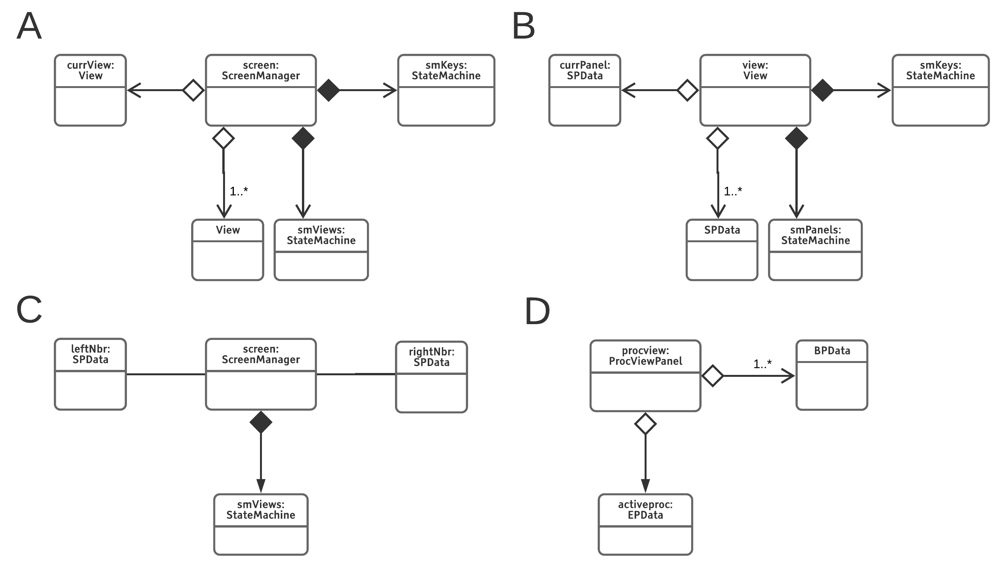</br>
**Fig. 9** UI Classes and their relationship to other UI classes and StateMachines


These classes functionally belong to the [UI module](#user-interface), and play central role in key input processing. Each of the UI class consist of [key dictionary state machines](#key-dictionary)(see below) that help these classes resolve the key input. They also consist of child UI object state machines (such as a `View` in case of `ScreenManager` or a `SimplePanelData` in case of a `View`), which helps the UI object determine which child UI object is in focus, and thus [the receiver of key information](#key-input)

#### Key Dictionary

As mentioned above, the [raison d' taire of a key dictionary](#single-key-single-context-but-many-actions) is to hold keys and their associated actions. The [KeyDict](html/classrtop_1_1KeyDict.html) class implements the key dictionary. Any UI object is able to resolve keys because its consists of [state machines](#state-machines) of `KeyDict`s. The `KeyDict` object essentially consists of a hash map of keys and their associated list of actions (implemented by [Action](html/classrtop_1_1Action.html) class). Thus a key dictionary encapsulates all possible actions associated with all keys active in a given state of a particular context (by context we mean the `ScreenManager`, `View`, `SimplePanelData`). If the state changes, so does the key dictionary 

[Action](html/classrtop_1_1Action.html) is a data structure that holds the UUID of an object (an object can be of any type) and its associated method name, which is the name of some public method of the type to which the UUID identified object belongs. These pieces of information are required to invoke any method associated with a specific object as explained in the discussion on [callbacks](#callbacks) 

The working of a key dictionary state machine is illustrated by the following example and diagram below


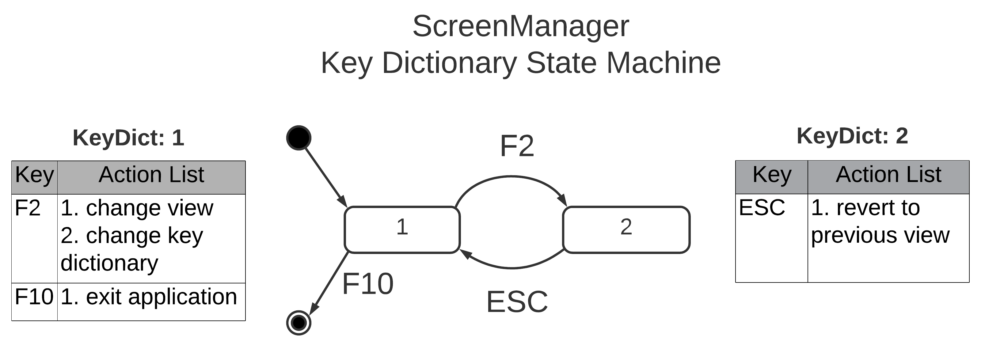</br>
**Fig. 10** Transitions of a `ScreenManager`'s `KeyDict` state machines. The key dictionaries associated with the states are show at the left and right ends. 

In the diagram we see how at the screen level, key dictionary state machine works. 
In the initial state, we have a key dictionary where only two keys makes sense, these are `F2` and `F10`. F2 changes the view from the current one to a different one, but it also changes the key dictionary where F10 /F2 are not recognized. If one presses, `ESC` they return back to the start state. On pressing F10 in the start state, one simply exits the application.


#### Callbacks


All keys associated actions are eventually invoked by calling the `invoke` method of object of type [MemFuncPDict](html/classrtop_1_1MemFuncPDict.html). This object contains hashmaps that stores two types of information. One hashmap has object UUIDs as keys, and object pointers as values. The other type has function names as keys and function pointer as values. There is one hashmap for each object type, and one hashmap for storing methods that belong to a certain object type. 
The `MemFuncPDict` object is initialized at application startup by registers specific objects and their method.

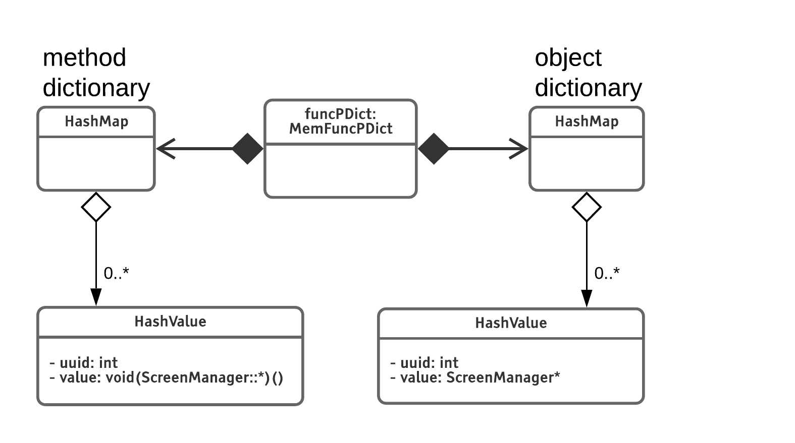</br>
**Fig. 11**Design of `MemFuncPDict`. The two types of dictionaries it holds are shown

When the `Action` object is passed to the invoke method, it uses `Action.uuid` to determine the object, and `Action.func_name` to determine the function pointer, and combines the information to invoke the public method of the object. 

Method pointers are referred to as callbacks, the benefits of having callbacks is that any UI object using its key dictionary can call any object anas its associated registered method. 

`MemFuncPDict` is part of the machinery responsible for resolving the key inputs. 

#### Process database under lock and key

The rtop design envisions multiple threads, which may all want to write to the internal process database. Such a scenario is a recipe for creating race conditions. Therefore process database has been put under lock, any process that needs to write to the process database must acquire the lock and release it when done. One must note that this locking mechanism has not been optimized. 

#### Logging using Boost

For logging, *Boost.Log* has been used. In the following discussion, its use as a debugging tool is described. If you want to understand Boost.Log's API, refer to its [documentation](https://www.boost.org/doc/libs/1_63_0/libs/log/doc/html/index.html) 

The most fundamental piece of information that logging provides is function call nesting. To achieve that, entry into and exit from every function of every class is logged. To accomplish that one needs to add the following  code at the beginning of the function body

```
log_spacer.addSpace();       
BOOST_LOG_SEV(lg, debug)<<log_spacer<<"log_message";
```

Since calls are heavily nested, it often becomes diffcult to read for a deeply nested call stack, what belongs in the stack and what is outside. Therefore, log messages were customized  by passing a special object of type [logSpacer](html/classlogSpacer.html) to the logger. This object keeps track of white space added to/deleted from it. When a function is entered, space is added to this object, when this object is passed to the logger on the subsequent line, that space is prepended to the log message. This has the effect of indenting the message to the right. If the calls are nested, their log messages will be shown clearly nested due to the indentation. 


Two crucial pieces for information are necessary to debug rtop. One is the specific thread on which a particular action was carried out, and second the temporal order of actions. Therefore we need both thread identity and time stamps. These facilities are provided by the Boost.Log library. 

An important feature of `logSpacer` is that it keeps the white spaces (for indenting) associated with each thread separate, so function call nesting within threads is correctly indented in log messages. 

For indenting to work properly, a log message added at the end of the function body must delete the white space. This is accomplished by writing the following code just before the exit point 
```
BOOST_LOG_SEV(lg, debug)<<log_spacer<<"log_message";
log_spacer.delSpace();
```
If a function has multiple exit points, these exit code snippets must be added before each.


Boost.Log also allows setting of logging levels, which means that one can make it more or less selective when logging information. If most debugging is complete, and performance needs to be optimized, the logging level can be set to the most selective i.e. FATAL, this will log minimal information. If more debugging information is desired, it is set to DEBUG. Offcourse, the developer must pass the appropriate log level to the logger, so that messages are printed appropriately. Using the FATAL logger for all messages defeats the purpose of using selective logging. 

#### Configuration Management


Configuration refers to two types of information, first refers to the system and the other refers to the application. System configuration includes such pieces of information as the number of CPUs on the system, operating system API and capabilities etc. This piece of information must be know before application start. Application configuration includes such pieces of information as key encodings which are used to [initialize the key dictionaries](). 

The system configuration is managed in two ways

Some types (belonging to the [business logic](#business-logic)) are responsible for introspecting the system at start time. They parse system specific information and use this information to apporpriately initialize the different class objects


Other types (also from *business logic*), parse configuration files, that describe the user interface layout and the key dictionary definitions that are used to initialize the UI objects. These configuration files are distributed with the application. 
 
The benefits of having having system configuration information that any changes in hardware/platform in the future, will only require us to make chnages to code responsible for doing introspection, we can build the UI logic independent of that. So it improves our applications portability and maintainability. The second configuration management allows us to tweak our UI layout without any code changes.

Currently there is a single file that holds UI related information, and its parsing logic can be much improved.  


#### Keyboard and mouse input


*The case of <kbd>ESC</kbd> key*</br>
To process each individual key press, NCurses API is used to the set the terminal in raw mode. In this mode, each key input is processed individually, as opposed to line mode, where one line (indicated by series of character followed by end-of-line character) is processed at a time. 
Ncurses defines easy to use macros for key value corresponding to special keys, for example `KEY_DEL` for <kbd>DEL</kbd> key. 
 
However, it should be noted a special key is not a single character value, instead it is a sequence of values, the first of which is the value corresponding to the <kbd>ESC</kbd> key. So whenever an ESC character is encountered, the system is configured such that it waits for the following character, to interpret the special key correctly. If it times out while waiting, then only the ESC key is reported. This makes processing of <kbd>ESC</kbd> key somewhat delayed. A user would experience a perceptible delay between pressing an <kbd>ESC</kbd> key and the associated action. This delay however is tunable, one can reduce the waiting time down to 100 msec, so that it is imperceptible to the user. One however has to make sure that under no circumstances a false negative is generated i.e. a special key is pressed, but the system does not wait long enough for the character after `ESC`, and prematurely declares that an <kbd>ESC</kbd> key has been detected.


*Mouse click processing*</br>
Mouse click events are also handled by the [key input thread](#separate-thread-for-key-input). Ncurses has a special key code for mouse click, this key, called `KEY_MOUSE` is defined as a constant. You capture it just like any other key, if you click any key on the mouse, the `int getch()` API will return `key = KEY_MOUSE`. 

To recognize and process individual buttons on the mouse, you need to define them using the `mousemask` API, like so 

```
 mousemask(BUTTON1_CLICKED, NULL);
```
Ncurses makes it easier to define these mouse button masks, by defining constants in the ncurses library. You could OR them, to allow the system to process multiple events. 

After getting the key, you need to obtain the specific event associated with a specific button press. Ncurses stores the specific event on a mouse button press internally. To access it, you pass `getmouse(MEVENT*)` API an event object. On successful return, the event can be found in the passed `MEVENT` object. Then you could AND it with specific masks to determine the kind of button pressed by the mouse.  

```
case KEY_MOUSE:
       if (getmouse(&event) == 0) // data OK
       {
         if (event.bstate&BUTTON1_PRESSED)
          printw("BUTTON1 PRESSED\n");
         if (event.bstate&BUTTON1_RELEASED)
          printw("BUTTON1_RELEASED\n");
         if (event.bstate&BUTTON1_CLICKED)
          printw("BUTTON1 CLICKED\n");
       }
```

### Analysis through use cases

Four use cases will be considered. First one tackles the periodic graphical update that is happening continuously every few 100-10000 msec depending on the application configuration. The second use case describes the chain of events when a user provides a key input. The third use cases deals with data flow between elements of the user interface and the final use cases describes how process data base is accessed when special actions such the sorting of displayed information is requested by the user. In each case, we describe the class APIs that are exercised, and the flow of data between the classes involved in generating that behavior.

#### Periodic refresh

There is no user input. The application is showing the process view panel, which is being periodically refreshed. This activity is handled in the [thread responsible for periodic updates](#separate-thread-for-key-input). The periodic refresh is achieved through a two step process, first the [Columns](html/classrtop_1_1Columns.html) class object performs a database update, and second, the top level [UI object](#ui-classes) i.e. the `ScreenManager` is asked to perform a graphical update
```
pclms->read();
screen->refresh();
```

The dataflow that occurs during the database update is summarized in the diagram below

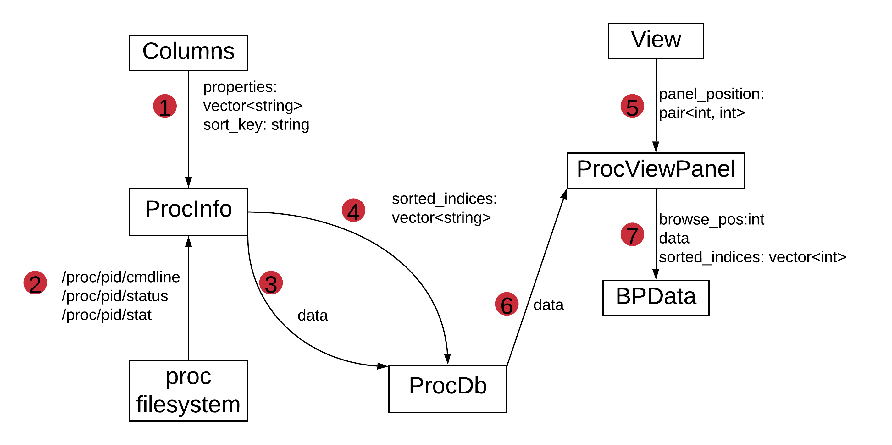</br>
**Fig. 12** Data flow during periodic graphical update


[Columns::read](html/classrtop_1_1Columns.html#a02a1991e906c74706dac193b2b6f2018) calls [ProcInfo::update](html/classrtop_1_1ProcInfo.html#acdb821aeef5a9fa279b99adf28f76b66). It passes on a list of string values that are names of process properties that need to be updated. There are potentially 10's of properties, but the method only passes properties that are visible, this is done to not unnecessarily increase the computational load and thus slow down the graphical update. The second argument will be discussed in a later use case. 

The [ProcInfo](html/classrtop_1_1ProcInfo.html) class has an internal reference to [ProcDb](html/classrtop_1_1ProcDb.html) which is the type that holds the process database. When `ProcInfo::update` is called, it [reads the information from the procfs](#accessing-and-parsing-proc-database) (and stores it in `ProcDb`. It also updates the sorting information `ProcDb` (discussed [later](#sorting-by-selecting-property-using-mouse)). These are steps 3 and 4 in the dataflow diagram above. 

At this point we have left the discussion on the internals of the process database, as these will be discussed at a later pointer when discussing sorting. 

Performing the graphical update involves a call to [ScreenManager::refresh()](html/classrtop_1_1ScreenManager.html#a95e9005896dbfb700ee175ed0a878e5c) which invokes refresh methods of its in-focus child UI object, similar calls are made recursively by the child (`View`) and its child(`ProcViewPanelData`) object. One might wonder, how does the data reach the UI panel object? [ProcViewPanel](html/classrtop_1_1ProcViewPanel.html) has a reference to the process database, which it accesses when [ProcViewPanel::refresh()](html/classrtop_1_1ProcViewPanel.html#a2fb73fd5a865d008aea9754830f5ad0e) is invoked by the parent `View` object. Therefore, data flows from `ProcDb` to the `ProcViewPanel`, and from the `ProcViewPanel` to its constituent panels which actually display the data. These are steps 5,6 & 7 in the dataflow diagram. 
 

#### Key input

This is a generic use case and encapsulates all events where a user provides a key input. The myriad possibilities for all the specific keys are not considered here, instead details are provided about mechanisms - how keys are recognized, how actions associated with them are invoked and how certain key inputs [change the context](#key-dictionary) in a given UI object. 

All key inputs are processed by the [key input activity loop](#separate-thread-for-key-input). Most of the time, this thread is waiting for key input. Once a key input is received, the received key is passed to the [ScreenManager::resolveKey](html/classrtop_1_1ScreenManager.html#af7ffd7b6a88a754850a43748d2a271c9) method which blocks until the key is resolved at all UI levels. 
 
Each UI object handles the key in two ways 

1. it resolves the key using its own [`KeyDictionary` state machine](#key-dictionary). The key dictionary state machine resolves the key by looking it up in the current key dictionary and [sequentially invoking](#callbacks) all the `Action` objects using the `MemFuncPDict` class object. It should be mentioned that a few actions are compulsorily invoked - updating the state of the UI object's [key dictionary and child object state machine](#state-machines). 


2. it passes the key to in-focus child object. In case of `ScreenManager`, the key is passed to the `View` object state machine, which will pass it to the current child object (which has the focus). 


These set of calls are made recursively by the UI objects down the heirarchy and any action at all the UI levels are completed. If at any UI object level, the key is not recognized, it is simply ignored, but it is still passed to the UI object one level below (if one exists). 


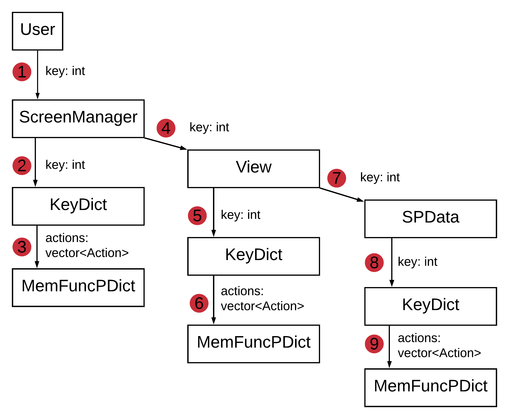</br>
**Fig. 13**Dataflow during passing of key value down the UI heirarchy**. `ScreenManager::resolve` (step 2) passes key information to `ScreenManager`'s key dictionary, which resolves it and passes on the list of `Action`s to the callback dictionary [MemFuncPDict](/html/classrtop_1_1MemFuncPDict.html) (step 3) for invoking functions associated with those `Action`s. `ScreenManager:resolve` also passes on the key to its in-focus child UI object (step 4). 

 
#### Changing settings

This use case is a specific instance of the more generic [key input](#key-input) use case described above. In this use case, the focus is on understanding how exchange of data occurs between two UI objects such as two panels that hold the property names. Specifically, we consider the case of adding new process properties to `Active Properties` panel, so that they can be displayed on the `ProcViewPanel`

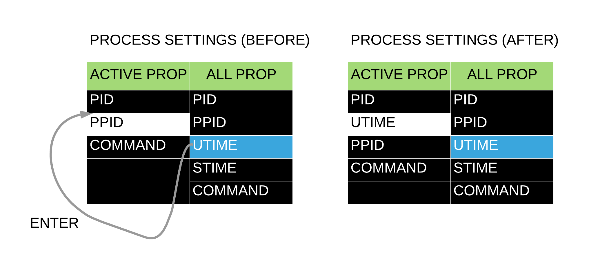</br>
**Fig. 14**Process Settings View. White entry indicates cursor position, Blue entry indicates that panel is in-focus as well as cursor position


As shown in the Fig. 14 above, once the user has navigated to `Settings` view and selected the property in the right column (`All Properties` panel), pressing <kbd>ENTER</kbd> key will initiate this use case. Assuming all the steps 1-6 in Fig. 13 have taken place, the focus is on understanding the specifics of the steps 7-8-9, in context of this use case. In step 7, the key is passed onto `All Properties` panel. It resolves it by passing it onto its key dictionary (step 8 in Fig. 13) which invokes [insertIntoLeftNbr](html/classrtop_1_1BrowsePanelData.html#a2093d1381edb681b6169b12af4c6a33c). This method, access the references to the left neighbour of `All Properties` panel, and passes the property string (of the selected entry) to the left neighbor using the neighbor's [insert(string)](html/classrtop_1_1EditPanelData.html#adac83f7f48336cafe0d5d1c6ab06ca0c) API. The neighboring panel then dutifully inserts the passed string at the current cursor position. Note that the `insert` API is not stable, and will probably be changed in the future. 


*Alternative implementation*</br>
At the `View` level (step 4-5-6 of Fig. 13), read the in-focus panel's selected entry using some API, and then insert that entry into its left neighbor using some other API. In this scenario, the individual panels need not hold references to their left and right neighbors. It makes more sense, as a panel should not be worrying about who its neighbor is, instead, the `View` class that stores the panels has the knowhow about how the panels' within it are arranged. This implementation requires one to handle callbacks of the form `(void *func)(string)` instead of one without any arguments, like `(void *func)()` in the current implementation. 
 

#### Sorting by selecting property using mouse

This use case describes the sequence of events once a user forces the `ProcViewPanel` to display the property values in a sorted order, based on the selection of a specific property (provided using a mouse click). The [handling of mouse input](#keyboard-and-mouse-input) has been described above. 
In brief, the input processing logic recognizes the type of mouse button pressed, if its a left button single click, it will determines its position on the `ProcViewPanel` and pass the button-click type and position to `ProcViewPanel`. The `ProcViewPanel` will then determine the column in which it lies, this determines the property according to which the sorting must be done. The `ProcViewPanel` will store this property name, to be accessed at a later time. The sorting property name value in `ProcViewPanel` is also initialized at application startup to some predefined value, so that even without the user input, there is a default sorting criteria. 

Once the sorting property has been determined, `ProcViewPanel` calls upon the [Columns::read](html/classrtop_1_1Columns.html#a02a1991e906c74706dac193b2b6f2018) method. You might recall that this method is also called during the [periodic refresh](#periodic-refresh) use case. As it turns out, sorting and database update are intertwined i.e. one cannot happen without the other. The reasons for having this arrangement are as follows

*Arguments for combining sorting and data reload*</br>
The design decision to be made is that when a user request changing a sorting criteria, should we sort existing data or reload new data and then sort. It makes sense to reload data to present the latest information to the user. It would make little sense if the graphical updates are happening frequently, however if lets say, updates happen every 5-10 seconds, the user will not be satisfied with stale information, they would much prefer both sorted and fresh information. This means that sorting implies data reload. 

There is also a compelling argument for the opposite case i.e. whenever a data reload is performed, sorting must be done as well. Imagine the case where sorting is being done according to PID. One must read all numeric directories in `/proc` directory, then iterate over the sub-directories using Linux API calls. However, such calls do not guarantee that sub-directories will be read in a sorted order, or even consistently in the same order. *The Linux Programming Interface by Kerrisk, 2nd says*


> The filenames returned by readdir() are not in sorted order, but rather in the order in which they happen to occur in the directory (this depends on the order in which the file system adds files to the directory and how it fills gaps in the directory list after files are removed). (The command ls –f lists files in the same unsorted order that they would be retrieved by readdir().) 

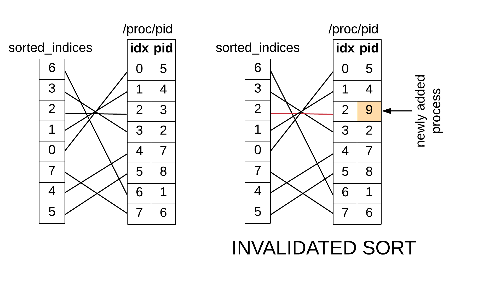</br>
**Fig. 15**Invalidation of sorting after the 2nd read
Even if `readdir` returned sub-directories in the same order, processes are being added and removed. As shown in Fig. 15 if 1 process were added and other removed, the 2nd read would return data in invalidated order. The only anti-dote is to sort everytime a data reload is performed. This means data reload implies sorting. 

Therefore whenever we perform sorting or data reload, we perform the other activity as well. 

*Dataflow during sorting*</br>
The diagram below describes the missing data flow information during [periodic refresh](#periodic-refresh). 

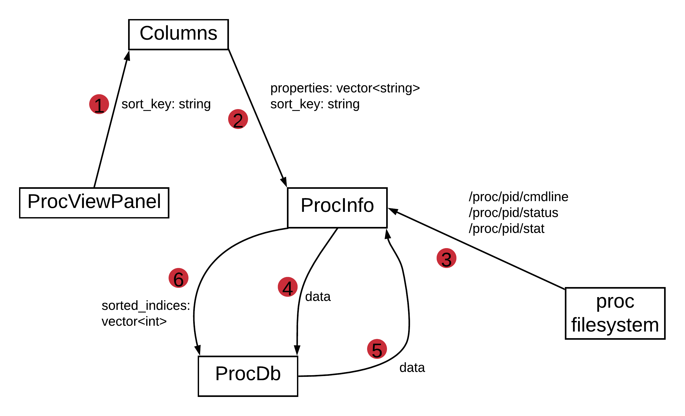</br>
**Fig. 16** Dataflow during sorting

`ProcViewPanel` passes the sortkey (property name according to which sorting needs to be done) to [Columns](html/classrtop_1_1Columns.html) when it invokes the `Columns::read()` method. The `Columns:read()` method passes the sortkey (along with [property strings vector](#periodic-refresh)) to [ProcInfo::update](html/classrtop_1_1ProcInfo.html#acdb821aeef5a9fa279b99adf28f76b66). This results in fresh process data getting acquired (step 3) from *procfs*, this information is stored in `ProcDb`(step 4), then a sort is performed on the read values (step 5), and an sorted index vector is stored back in `ProcDb` (step 6). The sorted index vector is stored in `ProcDb` because the UI objects will access the `ProcDb` (step 6, Fig. 16), and will use the vector to parse the `ProcDb` data in the sorted order.  


## References
- [NCurses HOWTO](http://tldp.org/HOWTO/NCURSES-Programming-HOWTO/index.html)
- [TTY Demystified](https://www.linusakesson.net/programming/tty/)
- [ncurses - windows]()
- [ncurses - doupdate]()
- [discussion on proc](https://news.ycombinator.com/item?id=12641155)
- [How fast is the /proc database updated?](https://unix.stackexchange.com/questions/74713/how-frequently-is-the-proc-file-system-updated-on-linux)


