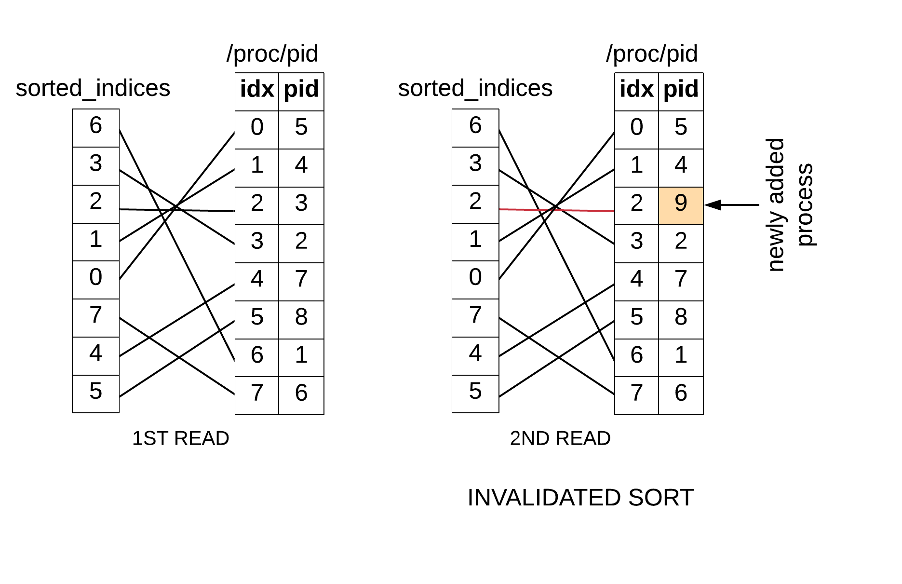

# rtop Design
## Table of Contents
- [Introduction](#introduction)
- [Architecture](#architecture)
- [Design](#design)
  - [Overview](#overview)
  - [Architectural considerations](#architectural-considerations)
    - [Separate thread for key input](#separate-thread-for-key-input)
    - [Key contexts](#key-contexts)
    - [Single key, single context but many actions](#single-key-single-context-but-many-actions)
    - [UI layout performance](#ui-layout-performance)
    - [Screen resizing](#screen-resizing)
    - [State machines](#state-machines)
    - [Accessing and parsing /proc database](#accessing-and-parsing-proc-database)
  - [Before we begin](#before-we-begin)
    - [UI classes](#ui-classes)
    - [Key dictionary](#key-dictionary)
    - [Callbacks](#callbacks)
    - [Logging](#logging)
    - [Configuration management](#configuration-management)
    - [Keyboard and mouse input](#keyboard-and-mouse-input)
  - [Analysis through use cases](#analysis-through-use-cases)
    - [Periodic refresh](#periodic-refresh)
    - [Key input](#key-input)
    - [Changing settings](#changing-settings)
    - [Sorting by selecting property using mouse](#sorting-by-selecting-property-using-mouse)

- [References](#references)


## Introduction

This is a design document, it details the design of some version of **rtop** with [these requirements](Requirements.md). This is meant for use by any developer who wants to understand/modify the rtop code. There are some prerequisities for this document to be well understood. It is assumed that

- developer is familiar with system process monitors in general, whether on Windows (Task Manager) or Linux (htop, top etc). 
- developer knows what a [Linux API] is, knows what we mean by [POSIX]() or [SuSv3]() compliant
- developer is familiar with C++ and C and has basic knowledge of data structures such as list, hash tables and trees. 

This document talks about two things - the architecture and design of rtop. In the architecture section, a broad overview of the main subsystems of rtop is provided with suitable references to the important requirements pertaining to the visual structure and functionality of rtop. Also provided is a list (in some cases with ratioale) of the tooling used in this project, so that the developer can jump start his/her own changes with minimal time spent on researching the tooling or replace some tools based on his/her own preferences. The design section details the subsystem design. We detail how each subsystem achieves its goals by describing in detail the rationale behind its decomposition into classes to achieve the desired functionality. Design alternatives will be discussed where ever possible. The language will be terse and diagrams will be used as a substitute of words. 

If you want to try [rtop]() and see what it is capable of, to better understand this document, see the [README](../README.md)

## Architecture

What is a text user interface? It is a user interface - the user can interact with it (i.e. manipulate it and also receive visual feedback). The visual feedback is all text based - all you can see on your screen is text. It may be tabulated/highlighted but that is pretty much the extent of it. When interacting with it, the user will typically be navigating across the screen and selecting some options. However, unlike the graphical user interface, navigation is restricted, in the sense that one can only move in quanta of horizontal characters and vertical lines on the screen. Text user interfaces are commonly used on today's [terminal emulators]() which emulate [character-based visual displays]() which did not have the capability of pixel level resolution. The limited spatial navigation capability may sound limited, but you may find that many text based user interfaces are quite rich - using just text highlighting and structured layout, a text user interface can have table, hidden menus and so forth. here is an example (may be??)

So what does it take to build such a text user interface (TUI). In the following sections we discuss the salient points in building the text interface for rtop which is deployable on Linux, specifically Ubuntu 16.04 LTS Desktop version 

### Building Blocks


TODO: should we relate our design to MVVM or MVC(don't even know what they are?)

Every text interface can be thought of as consisting of multiple building blocks each of which perform a specific function. There are two major concerrns we are trying to address when building a text interface. 

1. First is about how to build a text interface on the Linux systems? How are we going to visualize our display on Linux? How will be acquire input the the user provides? 

2. Second is about the specifics of the application or what is commonly referred to as the **business logic**. We must clarify as to how will be acquire and store the [information]() about processes? How will we layout this information? More importantly, how to design the system is a maintainable, extensible and clean manner?


We have decomposed the text user interface into following subsystems.   


#### System Interfacing 
There are many ways one can obtain information about a process's properties. The Linux kernel maintains this information in kernel data structures. Linux offers an API surface (more on this in design section) that allows users to access this information by reading process specific files. This information must be acquired at [regular intervals]() or [asynchronously]() when user invokes certain commands, stored at one place where it can be accessed efficiently or acted upon (potentially sorted).  
 

So our system interfacing module abstracts away the details of how the process specific information is acquired, and offers an API to easily access this information. 

One solid reason for hiding the OS specific details of how process information is accessed is **portability** & **maintainability**. The way in which process information is accessible across different revisions of the Linux kernal, as well as across different distributions of Linux (??citation needed) and across distributions that are Unix like. Coming to the portability issue, some of these problems can be solved by using POSIX/SuSV3 compliant API, which is confirmed to by all Linux distributions.

Secondly, it in general makes development faster, as other people can work on it independently. 


#### Business Logic
This module concerns itself with how the information is layed out (how many views?, what is in each view). This part usually follows in a straightforward manner from the requirements. It also concerns itself with user actions. What happens on wrong input? How to manage conditions that can potentially cause the system to crash? How to recover from bad inputs and crashes? It also concerns itself with how the user uses the system. What are all the features accessible to the user?

So the business logic module draws heavily on the functional requirements. What the user can/cannot do? How is bad input handled? What consitutes the bad input? This module orchestrates the actions of the other modules to achieve the desired functionality. 
 

#### User Interface
This module is concerned with managing the mechanisms underlying the display of text user interfaces on Linux systems, and how to acquire input through mouse and keyboard. It abstracts away the lower level details and provides a flexible API that allows one to build a sufficiently detailed layout of the interfaces, one that can be extended easily. It is also concerned with ensuring that both acquisition of input and generation of output are performed sufficiently fast. For example, there should not too much of a delay from a key press to it being detected by the system or delay between instruction to layout information and it being displayed on screen. 

To do its job, this module will deal with mechanism associated with correctly configuring and managing the terminal emulators found on Unix like systems. 
 

One important benefit that this module allows is simplifying the task of the business logic to create layouts and user input in a more intuitive manner. This simplifies the logic of the business module significantly and hence reduces the overall complexity of the system. Secondly it increase portability of the business module, by allowing it to use the same API across different terminal emulators and different systems. If we want to display the text user interface on a different terminal emulators, we only need to generalize this module to handle that, the business logic remains unware of which terminal emulator is being to present that information.  


#### Error Handling

This is a subsystem which is concerned with how to handle error conditions generated in the various subsystems and the overall operation of the program. It concerns itself with understanding the sources of errors and the actions that need to be taken to mitigate them. The error handling will depend on the specifics of the function/class etc, but in general the module will try to do one of three things

1.  ignore those errors, 
2.  take some corrective measures
3.  log and crash so that some debug information is accessible to the developer. 

Most the work that this module concerns itself with is logic that recognizes error conditions, defining error messages, defining the log format and interacting with logging framework. Usually it is the case that as we get deeper into design, we obtain more information about errors and then we enhance the design of this subsystem gradually to handle those cases. 

At the minimum, one needs a logging system (more on this in design section).  

It is must to handle errors properly. No system is perfect even at ship out, it helps to have logging so that error can be uncovered as the software runs. Even during integration testing (before shipping things out), logging helps immensely to resolve issues. 

### How do subsystems interact?

To better understand how rtop works, it will be instructive to understand how the subsystems (as described above) interact?. We describe two use casesto be instructive.  

#### Passive Viewing of Process Information
Let us suppose the we are viewing process information (getting updated every 1 sec). We have certain properties that are being displayed, and all we are allowed to do is either scroll up/down or sort the processes. 

During regular updates, information is travelling from the **system interfacing module** to the **user interface module**. This is quite a bit of information. Each process row can consistute upto 25 fields, where each one may be a string of size upto 10 characters. So that is 250 bytes per process, and there are typically 100's of such processes. So 25-100KB of data is flowing **systerm interfacing module** to **user interface module** every second 

Although not completely intra-module flow, but data is also flowing from the kernal to the **system interfacing module**, as it is reading the process information using the kernel API. 

Sorting involves user selectin one of the process properties using a mouse click. There are two choice one must consider here, the data flow for both cases is provided
1. Case 1: Sorting only the information that is being displayed currently. In this case, the **business logic** which has access to the displayed information, sorts the processes internally and refreshes the display. It only needs to know which property to sort (which it receives by recognizing the mouse click event from the **user interface module**), and send the new layout to the **user interface module**. The **system interfacing module** is not involved in this sequence

2. Case 2: First acquiring fresh process information and then sorting. In this case, the **busines logic** updates its internal database of process information, the applies the new sorting criteria (acquired from **user interface module**) and then refreshes the display (by sending updated layout to the **user interface module**). So there is information flow from **user interface module** to **business logic**, and back and forth between **business logic** and **user interface module**.    


Scrolling involves the user pressing a down/up arrow key which causes the display to be updated appropriately. The **business logic** receives this key input and acts to updates its internal database, it then sends the updated display back to the **user interface module**. So primarily there is information flow back and forth between **user interface module** and **business logic**
 

[diagram depicting data flow]()
- 3 subsystems
- double arrows, single arrow with varying thickness
- enough arrow length to display text on side of it
- short and precise and consistent naming of data packets
- descibe scenario underneath, for each of the interaction diagram


#### Configuring Process Viewing 
The user is allowed to alter the which properties are visible and even rearrange them. The user carries out a set of key presses to achieve the desired objective of configuring the panel appropriately. All of these actions are relayed to the **business logic**, which then updates its internal databse and communicates with the **user interface module** to display the changes on the screen. So all the key press information is traveling from the **user interface module** to the **business logic**, and the updated display information traveling back.  


### Extensibility  
TODO: revise

We would like to build upon the exiting version viewing of additional information. 
1. is to allow the system to [add new process properties to view]
2. add additional views for configuring other properties. 
3. add additional views for viewing overall system resource usage information, and associated view for viewing those. 
4. add additional functionlity in process view that allows the user to filter/signal processes, or view them in some alternate format altogether


Interface layout can be specified in text files. This is standard practices in most user interface technologies - whether .NET or Xamarin forms or anything else. This makes the task of specifying additional views in termns of layout easy. Offcourse any additional view does not exist in vaccum, we must hook it up appropriately so that it connect to some business component or data source appropriately. Therefore we must develop a hooking infracstructure that should allow us to easily accomodate new views

Any new view should allow some intraview navigation , for example can be scroll in it, how do we navigate between the different panels within it and so on. There should be some framework, according to which we build a view, that is what can and cannot go into it.  


### Tooling


#### Languages Choice
This project has been written in C++. For writing terminal interfacing code, we have called ncurses C libaries API from within C++ (??is this portable?) A very good reason, for developing this application in C++ is that it is object oriented and yet quite fast. Second major reason is simply to apply C++ skills


#### Linux API
Since we are confined to linux, we use linux system calls to call into kernel databases and read in process or perform other activities. The only criteria we must apply is that accessing this API should not require  admin permission, and second that it should be not jeopardize [portability]() of the subsystem using it. The latter is not a hard requirements, as we can manage portability using system introspection and then using system specific API. But it is certainly more clean to use portable API 

#### C++ Style Guidelines
TODO: need to add specific guidelines

We have followed [google style guidelines](), and some of the important ones we have used are listed here, to make your life easier when navigating the code


- google c++ style guidelines, source tree heirarchy
  - namespace organization 
  - class naming, class declaration
  - class public, private organization
  - class method naming and font
  - class method arguments naming and font conventions
  - standalone functions, globals, static
  - commenting and doxygen documenting: comments on classes, functions, globals, standalone functions

#### Version Control

We have use git for revision control 

Since we have only one devloper working on things, we prefer to build the rtop in a linear fashion. We have a single master branch on which all development and release happens. Each release is tagged for easy access, if one wants to use a specific release of rtop, they can download the release using the tag. Each release contains its requirements, installation instructions and design documents (such as this one). 

Sometimes, we may get stuck on a feature during the course of development, while we can make progress on some non-interfering piece of code (i.e. which will not created any merge issues). In such a case, we create a temporary branch to finish work on this new features, while we sort out issues with the features on the main branch. When we have resolved the issue with the main branch, we commit the result, and merge the temporary branch back into master. Temporary branches are not available as part of the repository.  


#### Debugging 

We have used GNU tools for debugging purposes, this primarily includes [gdb](). For more rigourous testing, we will use [valgrind]() for  measuring memory leaks. One of the most important tool we have for debugging is the logging system since text user interface are difficult to debug using tools like gdb(??citation).

We have used gdb version 7.11 or greater
?? How have we done the debugging
?? lcurses_g option

#### Testing

TODO: Formal testing not done yet

#### Distribution

The complete source code as well as the version history of the master branch is accessible rtop repository at [www.github.com/kasliwalr/rtop](www.github.com/kasliwalr/rtop) under MIT license. It has been tested for use on Ubuntu 16.4 LTS. Following the installation intructions in README will allow generation of an executable (requires make utility) using the make file in the source tree

The source code is organized as follows

```
.
├── bin
├── config
├── docs
├── include
├── libs
├── README.md
├── src
└── tests
```

|Source Tree Object| Description|
|-----------------|-------------|
|src| this contains the source code i.e. the .cpp files|
|include|header files|
|src/Makefile|make recipe|
|bin|build tree top level directory. single directory containing the generated executable|
|config|configuration file to be consumed by the application|
|tests|testing code|


TODO: 
- add license notices to source code
- also need to check if license is compatible with license of tooling used. 
 
#### Logging

Logging is our main tool for uncovering bugs. There are many logging systems out there with different features sets, open or closed source, language support on so forth. We state our main criteria for logging systems

1. should support formatted output
2. should be able to print thread specific information
3. should have a C++ API
4. should be well open source ideally copy-left like GPL, but non-copy FOSS is also fine (a general requirements for using 3rd party code)
5. should have a strong user base (which validates its usefulness and reliability) and is well supported
6. should have a stable API 


We have used the [Boost.Log](#third-part-libraries) packge of the vastly popular [Boost]() libaries

#### Development Tools

The development work will be done on an Ubuntu 16.04 LTS, with the following tools
1. gnu compiler collection: gcc 5.4.0 or greater
2. vim 7.4 or greater. It is used for stnadard editing and assumes the most common vim commands. You could use a lesser version if you like
 

#### Performance Measurement

TODO: what to measure? Memory leaks, performance bottlenecks. how to measure?

#### Third Party Libaries

1. Ncurses

2. Boost.Log
- licensing
- how does it work
- how big is it

3. Pugixml
- what is it
- how does it work
- how big is it

Tooling
- libraries
  - discussion on ncurses. why use it? which version of it to use. what does it do? licensing. **pg30**
    - **pg 112**
  - boost for logging. how does boost work. licensing.  
  - pugixml? why use pugixml. what are the alternatives?


## Design

### Overview


In this design document, the rationale behind the design and architecture of rtop will be explained. The purpose of writing this document is that another developer (which includes myself in the future) can easily understand the structure of the application and can easily extend or change the application to improve upon it. It will include a discussion on the architecture and implementation of important components of the system. Use cases are used to explain how the different components come together to provide the feature functionality. 


Looking at the application from a systems perspective, we focus on the top most level. The major components consist of the **rtop app**, some sort of **persistent information** database that it interacts with during initialization and at the time of exiting the application, the **procfs** (`/proc` file system) which provides the process information, and the **user** who provides commands through the text-based user interface that the application provides, and views the results layed out by the application. 

The data flow diagram below clarifies the flow of data between the different components

Description dfd\_level0: Lets start at the topmost level. As you know, rtop is a linux desktop app. This user directly interacts with this app, and data is exchanged between the user and the app through the keyboard and screen interfaces. On the computer, the app interacts with the file system to access configuration information which is stored in a file, and more importantly it user the Linux system api such as the `/proc` file system to access process information. This is a special feature of linux, which makes it easy for us to access information internal to the kernel. 

Data flow towards the app in case of `/proc` and `configuration` database. This is a very natural flow of data as you can think of the app as an interface that makes system specific information viewable to the human user. 


Before we move on, there are some meta design goals that are useful to briefly pause upon and consider, these generally fall under optimum design and good design practices etc.
 
1. Maintainability: For future maintenance work, code should be well commented (not overcommented). It should be as simple as possible, which means that the software should be decomposed well into modules which serve a clearly defined purpose. The classes within these modules, should follow the single respinsiblliy principle (SRP) - meaning they should do one thing and one thing only. The interfaces should be thin with fewest possible arguments i.e. consistent with information hiding. Only need to know information should be shared. And finally, it is very important that whereever it makes sense we should apply abstraction and simplify the use. this is a very important point, as in future one would like to change the implementation but not the interface - abstraction itself, so that other modules' code need not be changed

2. Extensibility: rtop could be extended in many ways. One may want to deploy it across different Unix derivatives, therefore the design should enable easy customization across potentially different APIs for accessing process information. One may want to add/modify features such as changing the key semantics - which key press does what. One may want also want to run it completely off the touch pad/mouse, or the keyboard. Besides these, one may want to tweak the existing algorithms or data structures to improve performance. These changes should not lead to major redesign 

3. Clean design: The design should be natural. We have not gone for unnecessary constructs if we don't need to. 

4. Performance: This aspect is still undefined. At this point specific performance criteria have not been defined to avoid premature optimization interfering with design. Any optimizations have been noted apporpriately. In general, the application is deemed adequate performance wise if it displays information at regular intervals and uses memory within limits 
  

### Architectural considerations


#### Separate thread for key input
There are two major activity loops in the application that run on independent threads. One loop is responsible for periodic graphical updates while the other handles user's key inputs. Handling user's key input in a separate thread allows optimization of user experience by ensuring that none of the user's key inputs are missed because the system is busy performing graphical update.  If the CPU is switching between the two threads suffiently fast, the key input thread will be able to capture all of user's key inputs.

From the perspective of understanding the application design, note that any activity happens in one of these two activity loops. The diagram further clarifies the operation of the two activity loops running in two separate threadss  


**DESCRIPTION??**


It has to acknowledged that this scheme is suboptimal, although key inputs are being captured on a separate thread, a similar problem as running everything on one thread, is encountered. If the key press results in some time consuming graphical update, it will block the key input thread in that activity, if during this period a key input arrives, it will not be registered. To the user, it will seem like the interface is unresponsive, especially for frequent key inputs that cause time consuming graphical updates.

How fast can key input come in, key processing speed depends on the keyboard, and it ranges from 30 - 60 key prresses per seconds, that roughly translates to 1 key press every 15-30 msec. If we need to handle they key presses, our key input loop should capture these key presses as soon as possible, and get ready again to read the next key input. On one system, the speed was measured to be approximately 30 key presses per second

Here is the reference code
```

 initscr();
 raw();
 noecho();
 keypad(stdscr, TRUE);
 set_escdelay(100);
 int c;
 int count_arrow = 0; 
 while(1)
 {
   c = getch();     
   if (c == KEY_F(10))
    break; 
   count_arrow++; 
 }	
  
 endwin();
 std::cout<<"KEY_DOWN pressed "<<count_arrow<<" times\n";
}
```


**EVENT DRIVEN ARCH??** 


#### Key contexts

To understand application design, it helps to understand a somewhat abstract idea of key context.The application should be viewed as consisting of different contexts. Actions such as exiting the application or viewing a separate view (a view covers the entire terminal window) belong to the application context. Actions such as navigating within a view by accessing its different panels ( a view is divided into several spatially separate regions called panels) belong to the view context. Finally actions such as browsing/modifying an item list within a panel belongs to the panel context.
 
To summarize, each key has a context in which it makes sense, and the context alone knows how to interpret the key. The same key may exist in multiple contexts allows us the ability to operate in several context with a single key press. 

#### A single key, single context but many actions

A single key press may lead to multiple actions through invoking of multiple object methods. This information is obviously encoded in an object associated with a key context (such as view, panel etc). This information is handled conveniently using a data structure which associates with a particular key a list of `Action` objects (an `Action` is a tuple that encodes an object's identity and one of its methods). This object can be passed on to the context object at the time of initialization. In this regard, one should note that it would not be useful to hard code the actions that are to be triggered in the object. Let's explain the problem through an example. Let's refer to a key input managed at some view object. Suppose, on this input, 5 different actions need to be performed. If we hardcoded these actions inside the view object, it will be hard to maintain (as we'd have to make many different view objects with different hardcoded actions) and therefore error prone. Thus having as many view object types as there are variations in key input process is a total unreasonable solution

**LINK TO ACTIONS, DATA STRUCTURE??**


#### UI layout performance


Although performance optimization is not a priority at this time, there is one area where upfront optimization is well advised. To understand it need it is important to understand, how graphical updates are done in this application. The Ncurses library has been used for managing the interaction with the user, so it is important to understand how Ncurses performance graphical layout.   


Ncurses introduces some abstractions between the data to be put on screen and actual physical screen. The crux of the matter is to use these abstraction properly so as not to unnecessarily slow down the graphical updates. 

Ncuses has an abstraction called **WINDOW**, which is an object that represents a section of the physical screen. Internally, it maintains a representation of the **phyiscal screen** (which contains the last read state of the phyiscal screen) and a **virtual screen** (which contains the state that the user wants to render on the physical screen). A **WINDOW** represents a section of the **virtual screen** and a screen may be (and usually is) subdivided into multiple windows - we call this a **tiled** screen (divided into spatially non-overlapping regions). So lets say you tiled a screen, you modify a small region of the screen corresponding to one or more WINDOWs and now you want to put on the information ont the screen. 


The function to perform this update has the following prototype 
```
wrefresh(WINDOW* win);
```
On each `wrefresh` two internal functions, `woutrefresh(WINDOW* win)` and `doupdate` are called, the first one puts the information in the WINDOW data structure into the virtual screen. The `doupdate` then compares the physical and virtual screen and pushes the difference onto the physical screen. So instead of everything being redrawn, only the region specific to the changed window is updated. This brings us to the first optimization


Optimization 1: Divide the view, into separate windows, such that separate activities map to different windows. This allows us to update only specific windows and reduce the cost of physical screen update


It was mentioned above that each `wrefresh` corresponds to two actions. If two window udpates are happening relatively quickly (so that the user may not notice), one should avoid calling `wrefresh` for each window. This brings us to the second optimization


Optimization 2: Where ever possible instead of multiple `wrefresh`, do multiple `woutrefresh` and a single `doupdate`. 


The ideas above are described in the diagram below 

**DESCRIPTION??**


#### Screen resizing

One must understand that the application runs on terminal emulators rather than real terminals, and thus unlike real terminals, the size of the screen can change. Screen resizing is a possible user action. This user action is not handled by the terminal emulator, meaning that although the window size is changed (by the windows manager), a signal to the client process is sent. It is the job of the client process (i.e the application) to handle this appropriately. Not handling it can be deterimental to the application. If we don't notify the application, it will continue to assume the old window size, and will try to render information on regions that do not exist anymore. 

Therefore handling it is a necessity for the quality of user experience. If you run such an application in debugger (such as gdb) and configure it to handle signals, you will see something like this

```
> handle SIGWINCH print
> r CONFIG_FILE
# window resized
Thread 1 "rtop_v0_1" received signal SIGWINCH, Window size changed.
terminate called without an active exception
```

Once, the application has the screen size information (size and position of windows), it can scale and reposition the layout as necessary. Obviously extreme resizing events should be handled appropriately as well, one cannot expect to resize the windows to very small size.

As of now, this is not handled in the application, but is a high priority item. In the current version, the application crahses on a screen resize. 

#### State machines

The `StateMachine` [class]() is designed to store object universal unique identifiers (uuids). In the application, state machines are used to hold objects of type [Key Dictionaries](), [View]() and [SimplePanelData]()

Its API allows initialization, obtaining prev and current state information and transitioning to next state based on input. You might find additional API such as `stale` and `reset`, these might be deprecated in future, and it is not deemed necessary to explain them at this time. 

#### Accessing and parsing /proc database

All unix based systems makes process information through the pseudo file system, called proc file system or procfs for short. For each process running on the system, there is one directory in the `/proc` named by the pid of the process, for example init process (with pid 1), will have its information located inside directory `/proc/1/`

There are various files inside the directory, where the information is distributed, we are interested in 3 files, namely

`/proc/pid/stat`, `/proc/pid/cmdline` and `/proc/pid/status`


These files are in the text format and the specific format for each may depend on the particular system. Once we open a file, we can parse the text file and store the information however we like, but there are some important consideration when updating the database for all the processes (active or zombie).  Since processes are getting added and deleted all the time, we have to be careful of race conditions while parsing the `/proc` directory. 


Accessing /proc database can generate race conditions. Here is an example...

How do we handle these race conditions, and what are the costs of doing that?

>If the contents of a directory change while a program is scanning it with readdir(),
the program might not see the changes. SUSv3 explicitly notes that it is unspecified
whether readdir() will return a filename that has been added to or removed from
the directory since the last call to opendir() or rewinddir(). All filenames that have
been neither added nor removed since the last such call are guaranteed to be
returned.


[How fast is the /proc database updated?](https://unix.stackexchange.com/questions/74713/how-frequently-is-the-proc-file-system-updated-on-linux)

This discussion implies that the directory `/proc` is populated when we open the directory for reading. So we take one snapshot at the time of opening. Now when we start scanning it using readdir, we inspect each process's pid directory. It is at this time, again that this information is updated, if we try to access the directory pid in /proc, but the process by that pid does not exist, the open call will return an error. New process may be added while you are scanning readdir, in such as case, you may not scan through it i.e. you may not know if a process has been added or you may. 


Lets make some design decisions here - 

1. if we have scanned through a process, and before we finished scanning the process was killed, is that ok? sure. we may be a bit outdated, but we'll pick it up at the next refresh

2. a new process was added since we opened `/proc`, as said above, we may or may not encounter it, that is ok too. we'll pick it up at next refresh. Addition of new process does not mess up our scan order in any way, meaning we are not going to go through it again

3. if a process we read was killed before we finished scanning, and a new one was added with the same id and we happen to pick it up, would be have duplicate, this is quite undesirable. There is low proabability of such an event, as athe read is usually complete within a few 10s of msec at most, while it is UNix policy to delay the reassignment of recently deceased process id. 

4. A process was present when we opened /proc, but not found somehow, when we tried to access its files any of its files. This could only means that while we were parsing the files, the process died, 

5. Another possibility is that while we have opened the /proc/pid/status file, are reading it, the process died, so assiming the kernel data structures associated with the file are being destroyed, how are we able to read the file status, if they are not being destroyed, are we interrupting the process status in some way??


Here is our current strategy, we read the /proc file, we iterate through the directory entries. Then we access each of status, cmdline and stat files, if we are unable to access of of the file, we interpret it to mean that the process has died. Therefore we skip its information and move onto the next entry. For us, any process that died after we read the entry is still alive and we display its last obtained information. 


### Before we begin

We will frontload information about a few important classes and their relationships, so that we explain the data flow in the different uses cases things start to fall in place easily. You can skip ahead if you like, and come back and refer to this section


#### UI Classes

Three types of user interface classes, cooperate together to handle all key inputs from the user and requests from other modules to perform graphical updates. [ScreenManager](), sits at the top of the heirarchy, it references one or more objects of the [View]() class. At the lower most level is the [SimplePanelData]() class. A `View` class references or or more `SimplePanelData` class objects. There is also the [ProcViewPanel]() which is also an panel of special type that references other simpler panels

These class relationships are depicted through the class diagrams below. Note that in these diagram references to other types of objects are also made, which will be discussed shortly  


When consider key input processing, one should consider these classes that encode the context. They consist of key dictionary state machines, that are actually responsible for resolving (performing actions associated with a key input) the key input for that particular context. They also consist of a lower level UI object's (such as a `View` in case of `ScreenManager` or a `SimplePanelData` in case of a `View`) state machine, which process the key input to update the current UI object in focus. 


#### Key Dictionary

As mentioned above, the raison d' taire of a [KeyDictionary]() is to hold keys and their associated actions. A key dictionary is an object which is essentially a hash map of keys and their associated list of [Actions](). Each key may have more than one action associated with it. Thus a key dictionary encapsulates all possible actions associated with all keys active in a given state of a particular context (by context we mean the `ScreenManager`, `View`, `SimplePanelData`). If the state changes, so does the key dictionary 

[Action]() is a data structure that holds the id of the object and its associated method name. These pieces of information are required to invoke any method associated with a specific object (by accessing them using function pointers stored in another object called [MemFuncPDict]() ). In the diagram we see how at the screen level, key dictionary state machine works. 


**DESCRIPTION??**

In the initial state, we have a key dictionary where only two keys makes sense, these are `F2` and `F10`. F2 changes the view from the current one to a differnt one, but it also changes the key dictionary where F10 /f2 are not recognized. If one presses, `ESC` they return back to the start state. On pressing F10 in the start state, one simply exits the applciation. 

#### Callbacks

As mentioned above object methods pointers are stored in an object of type [MemFuncPDict](). It contains a bunch of hashmaps (as shown in the figure below), where each hashmap contains a list of object\_uuids (keys), and their associated callbacks (which are pointer to methods belonging to the object). The hashmaps belong to a certain type meaning that each map actually contains callbacks associated with methods of a certain class type. 

If one wants to invoke a method associated with a specific object, the simply pass on the `Action` object to the invoke method of `MemFuncPDict` object which will then appropriately resolve it 


**DESCRIPTION??** 


#### Process database under lock and key

although we have not discussed it yet, but we envision the process data base to be read by one thread and written to by another thread depending on the use case (discussed further down), this is a classic scenario for generating race conditions, and therefore we need to put the process database under lock and key. Any process that needs to read the process database must acquire a mutex associated with it, once done reading it should release it and so on. 

This idea needs to be fleshed out in future versions.


#### Logging


Logging is used as debugging tool. The [Boost.Log]() library part of the [Boost]() library, is used to log key pieces of information. For logging a multithreaded application, the thread identity as well as time stamps are necessary - the Boost.Log api provides this piece of information. Some customization of log message was done to make the nesting of function of calls more human-readable. The customization details are as follows 

Entry and exit into every function of every class is logged. To accomplish that one needs to add the following  code at the beginning of the function body

```
log_spacer.addSpace();       
BOOST_LOG_SEV(lg, debug)<<log_spacer<<"--> KeyDict-"<<key_dict_uuid<<"_resolve::";
```

The `log_spacer` object belong to the [logSpacer]() class that keeps track of white space that added to it and deleted from it. When we enter the funtion, we add space to this object, when this object is passed to the logger on the subsequent line, that space is prepended to the log message, this has the effect of indenting the message to the right. If the calls are nested, their log messages will be shown clearly nested due to the indentation.

Another important feature of `log_spacer` is that it keeps the white spaces associated with each thread separate, so function call heirarchy within threads is correctly indented in log messages

For the indenting to work properly, a log message is also added at the end of the function body, to delete the white space, like so
```
BOOST_LOG_SEV(lg, debug)<<log_spacer<<"<-- KeyDict-"<<key_dict_uuid<<"_resolve::";
log_spacer.delSpace();
```
If a function has multiple return points, these code snippets must be added before each return.  

There is some overhead associated with logging, so log level should be set appropriately while debugging.  

#### Configuration Management


Configuration refers to two types of information, first refers to the system and the other refers to the application. System configuration includes such pieces of information as the number of CPUs on the system, operating system API and capabilities etc. This piece of information must be know before application start to properly parse the relevant pieces of information. Application configuration includes such pieces of information as key encodings (which may be changed), working with different keyboards. 

The system configuration is managed in two ways, certain specific modules are responsible for introspecting the system at start time. During this these modules read system specific information and use this information to apporpriately initialize the different class objects

Then there are configuration files which are distributed with the application, these files describe the user interface layout and the key encodings it works with. This allows one to easily alter the behaviour of various UI contexts at the level of screen/view/panel. These files are parsed at start time, and the information again is used to properly initialze the different objects. 


The benefits of having having system configuration information that any changes in hardware/platform in the future, will only require us to make chnages to code responsible for doing introspection, we can build the UI logic independent of that. So it improves our applications portability and maintainability. The second configuration management allows us to tweak our UI layout without any code changes.

Currently we have a single file that holds UI related information, and its parsing logic can be much improved.  


#### Keyboard and mouse input

Although not currently implemented, this is part of version 0.1. Mouse click events are handled are also handled by the key input thread. If you are using ncurses, the way its done is as follows


Ncurses has a special key code for mouse click, this key is defined as a constant, in the ncurses library, it is called `KEY_MOUSE`. You capture it just like any other key, if you click any key on the mouse, the `getch` will return `key = KEY_MOUSE`. 

To process recognize and process individual button on the mouse, you need to define them using the `mousemask` method, like so 

```
 mousemask(BUTTON1_CLICKED, NULL);
```
Ncurses makes it easier to define these mouse button masks, by defining constants in the ncurses library. You could OR them, to allow the system to process multiple events. 

After having obtained the key, you need to obtain the specific event associated with a specific button press. Ncurses stores the specific event, to access it you pass `getmouse` an event object, on successful return, the event will have been stored in the event object you passed. Then you could AND it with specific masks to determine the kind of button pressed by the mouse.  

```
case KEY_MOUSE:
       if (getmouse(&event) == 0) // data OK
       {
         if (event.bstate&BUTTON1_PRESSED)
          printw("BUTTON1 PRESSED\n");
         if (event.bstate&BUTTON1_RELEASED)
          printw("BUTTON1_RELEASED\n");
         if (event.bstate&BUTTON1_CLICKED)
          printw("BUTTON1 CLICKED\n");
       }
```
#### The case of <kbd>ESC</kbd> key

One can perform key capture by using NCurses API to set the terminal emulator in raw mode. In this mode, each key input is processed individually, as opposed to line mode, where one line (indicated by series of character followed by end-of-line character) is processed at a time. 
Ncurses defines easy to use macros for key value corresponding to special keys, for example `KEY_DEL` for <kbd>DEL</kbd> key. 
 
However, it should be noted that the special keys is not a single character value, instead it is a sequence of values, the first of which is the value corresponding to the <kbd>ESC</kbd> key. So whenever an ESC character is encountered, the system is configured such that it waits for the following character, to interpret the special key correctly, if this waiting times out, then only the ESC key is reported. This makes processing of ESC key somewhat delayed. A user would experience a perceptible delay between the pressing an ESC key and the associated action. This delay however is tunable, and one can reduce down to 100 msec, so that it imperceptible to the user. One however has to make sure that under no circumstances do we accept a false negative i.e. a special key is pressed, but we don't wait for the following character and thus deem the key not to be the special key but the `ESC` key


### Analysis through use cases

Four use cases will be considered. First one tackles the periodic graphical update that is happening continuously every few 100-10000msec. The second use case describes the chain of events when a user provides a key input. The third use cases deals with data flow between elements of the user interface and the final use cases describes how system data base is accessed when special actions such the sorting of displayed information is requested by the user. In each cases, we describe the class APIs that are exercised, and the flow of data between the classes involved in generating that behaviour.

#### Periodic refresh

In this use case...
- there is not user input, the application is showing the process view panel, which is being periodically refreshed by some business logic. This activity is handled in the thread responsible for periodic updates. The columns class invokes its read method which updates the process data base. 
The periodic refresh is achieved through a two step process, first the `Columns` class object performs a database update, and second, the top level UI object i.e. the `ScreenManager` is asked to form a graphical update
```
pclms->read();
screen->refresh();
```

The dataflow that occurs during the database update is summarized in the diagram below


**DESCRIPTION??**


[Columns::read]() calls [ProcInfo::update\(vector\<string\>, string\)](). It passes on a list of string values that are names of process properties that need to be updated. There are potentially 10's of properties, but the method only passes properties that are visible, this is done to not unnecessarily increase the computational load and thus slow down the graphical update. The second argument will be discussed in a later use case. 

The [ProcInfo]() class has an internal reference to [ProcDb]() which is the type that holds the process database. When `update` is cllaed, it reads the information from the `procfs` and stores it in the database. It also updates the sorting information in the process database (discussed later). These are steps 3 and 4 in the dataflow diagram above. 

At this point we have left the discussion on the internals of the process database, as these will be discussed at a later pointer when discussing sorting. 

When the call to [ScreenManager::refresh()]() it invokes refresh methods of its child UI object that is currently in focus, similar calls are made recursively by the `View` and `ProcViewPanelData` class. One might wonder, how does the data reach the UI panels. [ProcViewPanel]() has a reference to the process database, which it accesses when [ProcViewPanel::refresh()]() is invoked by the parent `View` object. Therefore data flows from the process database to the `ProcViewPanel`, and from the `ProcViewPanel` to its constituent panels which actually display the data. These are steps 5,6 & 7 in the dataflow diagram. 
 

It is to be noted, that in the current implementation, that although the refresh works, it is not efficient. This issue will be addressed very soon. THe problem is that the complete screen (parent window) is being updated for updates to each constituent window.  


#### Key input

This represents the use case...
nged. What we want to explore here is how keys are processed, how are they recognized, how are action associated with them taken, and how context changes are reflected in the choices of the key that are available


This is a generic use case and encapsulates all events where a user provides a key input. The myriad possibilities for all the specific keys will not be considered, instead details are provdided about the mechanisms that kick in i.e. how keys are recognized, how actions associated with them are invoked and how certain key input change the context in a given UI object. 

All key inputs are processed by the [key input activity loop](#separate-thread-for-key-input). Most of the time, this thread is waiting for key input. Once a key input is received, the received key is passed to the [ScreenManager::resolveKey(int)]() method which blocks until the key is resolved at all UI levels. 
 
Each UI object handles the key in two ways 

1. it resolves the key using its own `KeyDictionary` [state machine](). The key dictionary state machine resolves the key by looking it up in the current key dictionary and sequentially invoking all the [Action]() objects using the [MemFuncPDict]() class object. It should be mentioned that a few actions are compulsarily invoked, this handle update the state of the UI object's state machine that represent the key dictionaries and child UI objects. It should also be emphazied why there is a need for a key dictionary state machine rather than a single key dictionary. This is because sometimes pressing a certain key invalidates it and instead new set of key become relevant for the UI object. It working is explained in the section on [key dictionary](#key-dictionary)


2. it passes the key to the child object that currently has focus. In case of `ScreenManager`, the key is passed to the `View` object state machine, which will pass it to the current child object (which has the focus). 


These set of calls are made recursively by the UI objects down the heirarchy and any action at all the UI levels are completed. The diagram below depicts the dataflow during passing of key value down the UI heirarchy

If at any UI object level, the key is not recognized, it is simply ignored, but it is still passed to the UI object one level below if one exists. 


**Description??**
Let's try to understand the dataflow, the first call is to `ScreenManager::resolve(key)` passes the key information to `ScreenManager`'s key dictionary, which resolves it and passes on the list of actions to the global callback repository for invoking the functions associated with those actions. Next the `ScreenManager:resolve()` passes on the key to its child UI object, which is in focus. And as obvious from the data flow diagram, it carries out a similar set of actions, and the same thing goes on with the Panel expect that in the panel's case, there is not other child object to process the data. 

 
#### Changing settings

Although this use case too is triggered by user's key input, it is of specific interest as it does not deal with accessing system information. Rather it deals with exchange of pre-existing data between two panels. This happens when for example we are adding new process properties to the ACTIVE PROPERTIES COLUMNS, so that they can be displayed on the `ProcViewPanel`. 

Only the final step of adding the property in the ALL PROCESS PANEL to the ACTIVE PROCESS PANEL is considered. The specific property has been selected and the user presses the <kbd>ENTER</kbd> key. The usual series of steps associated with the key press take place, when the key is passed onto the ALL PROCESS PANEL, it resolves it by passing it onto its key dictionary which invokes [BrowsePanelData::insertIntoLeftNbr](). To handle this situation, each panel stores a references to its left and right neighbours. The `insertIntoLeftNbr()` method reads the string corresponding to the selected property, and passes the string to its left neighbour's [BrowsePanelData::insert(string)]() method. The neighbouring panel then dutifully inserts the new string into current cursor's position.   

Note: It could alternatively have been implemented in the following manner. At the view level, read the in-focus panel's selected entry using some API, and then insert that entry into its left neighbour using some API. In this scenario, the individual panels need not hold references to their left and right neighbour. It makes more sense, as a panel should not be worrying about who its neighbour is, instead, the `View` class that stores the panels has the knowhow about how the panels' within it are arranged. However, we would need to work with callbacks of the form `(void *func)(string)` instead of one without any arguments like `(void *func)()`. 
 

#### Sorting by selecting property using mouse


Althoug not currently implemented, the next version will allow the user to select a property column in `ProcViewPanel` using a mouse click. This will result in refreshing of the display so that all property are sorted based on the sort order of the selected property column. 

The sequence of events immediately post mouse click are not described as they are not implemented yet, you may refer to the discussion on [handling of mouse events](#keyboard-and-mouse-input). 

Selection of property for sorting at startup: The input processing logic recognizes the type of mouse button pressed, if its a left button single click, it will determines its position on the `ProcViewPanel` and then determine the column in which it lies, this determines the property according to which the sorting must be done. It will then store this property name inside it, to be accessed at a later time.
At startup, since there has been no trigger to acquire this property, we ensure that we initialize it.


`ProcViewPanel` calls upon the `Columns::read` method. You might recall from the [periodic refresh]() use case, that this method is also called there. As it turns out sorting and database update are intertwined. The reason for having this arragement are as follows


Why sorting needs to be done at every refresh?
When a user does a mouse click, should we sort existing data or refresh the data and then sort. It made sense to refresh data to present the latest information to the user, it would make litle sense if the UI is getting updated quite frequently, however lets say the UI is getting update every 10sec and the user does a mouse click, they are obviously interested in the latest piece of information, so we choose to update for everytime a user clicks. 

This implies that whenever sorting is done, a database read is done as well. 

Now we'll also argue that when a database read is done sorting is done.
There are multiple reasons for doing so

Suppose we are sorting things according to pid. To read the system information from the procfs, we need to list all the numeric directories in `/proc` directory. Then we iterate over the sub-directories using linux api calls, however such calls do not guarantee that they will be read in a sorted order, or even consistently in the same order. 

> The filenames returned by readdir() are not in sorted order, but rather in the order in which they happen to occur in the directory (this depends on the order in which the file system adds files to the directory and how it fills gaps in the directory list after files are removed). (The command ls –f lists files in the same unsorted order that they would be retrieved by readdir().) Even if readdir returned things in the same order, processes are being added and removed and would invalidate the previous sorting order as shown in the diagram below 


**DESCRIPTION??**
but at the time of next read the order might be different, or that a single process has ceased to exist and replaced by another process. This invalidates our sorted indicies array. Therefore we need to sort everytime.  

Therefore we need to sort everytime we refresh the display. In summary everytime we sort/refresh, we do the other as well. 


The dataflow during sorting is outlined in the diagram below
`ProcViewPanel` passes the sortkey to [Columns]() when in invokes the `Columns::read()` method. The `Columns:read()` method passes the sortkey along with property string vector to [ProcInfo::update(vector\<string\>, string)](), based on this sortkey, first fresh information is acquired from procfs, this information is stored in [ProcDb](), then a sort is performed on the read values, and an index vector is stored back in [ProcDb](). The information is stored in [ProcDb]() because the UI objects will access the `ProcDb`, and will use the sorted index vector to parse the `ProcDb` data in the sorted order.  


**DESCRIPTION??**


### Next
- have we identified and described the error conditions generated during the different use cases
  - only partially, handling spurious key input

- what about logging?
  - not done
- on UI layout specification using a file
- on configuration management


## References
- [NCurses HOWTO](http://tldp.org/HOWTO/NCURSES-Programming-HOWTO/index.html)
- [TTY Demystified](https://www.linusakesson.net/programming/tty/)
- [ncurses - windows]()
- [ncurses - doupdate]()
- [discussion on proc](https://news.ycombinator.com/item?id=12641155)


### TOC


- [References](#references)

- [Checklist](#checklist)


### References
 


### Checklist

#### Diagrams & Images

1. dfd0: no annotation for database, add figure description, explain how user is interacting with app. explain what /proc is. explain for database is

2. dfd1: explain what data is getting transferred between the modules, explain their roles better, should be add a control module

3. activity loops: add legend, verify symbols

4. class diagrams: add legend to figure, add description. cleanup notation, how to express collections properly 

5. add a digram in performance section to explain window updates - see Details(2)


#### Checklist

1. add references


 


#### Keywords
use case
rtop
periodic updates
periodic
periodic graphical updates
key contexts
activity loops
thread
key input/s
unresponsive
list of actions
function pointers
method pointers
screen resize
UI object
UI focus 
